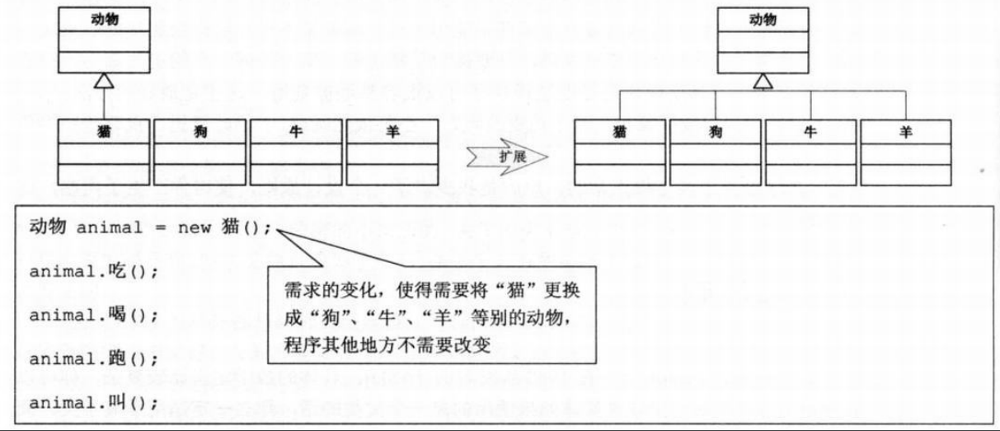

```json
{
  "date": "2021.05.05 12:00",
  "tags": ["sjjg","数据结构","PHP"]
}
```


## 概念
1. 高层模块不应该依赖低层模块。两个都应该依赖抽象。
1. 抽象不应该依赖细节。细节应该依赖抽象。


## 怎么理解？

<br />**依赖倒转原则，说白了就是针对接口编程，不要对实现编程。**
<br />
<br />就如电脑构造，无论主板，CPU，内存，硬盘都是针对接口设计的，如果针对实现设计的话，内存就要对应到具体某个品牌的主板，那就会出现换内存需要把主板换了的尴尬。
<br />
## 为什么要叫倒装呢？

<br />面向过程编程时，为了使得常用代码可以复用，一般都会把这些常用代码协程许许多多函数的程序库。这样我们在做新项目时，去调用这些低层的函数就可以了。
<br />
<br />比如我们做的项目大多要访问数据库，所以我们就把访问数据库的代码写成了函数，每次做新项目时就去调用这些函数，这也叫做高层模块依赖低层模块。
<br />
### 问题出在哪？

<br />我们在做新项目时，发现业务逻辑的高层模块都是一样的，但客户却希望使用不同的数据库或存储信息方式，这时候就麻烦了，我们希望能再次利用这些高层模块，但是高层模块都是与低层的访问数据库绑定在一起的，就没办法复用这些高层模块。
<br />
<br />这就像PC中CPU，内存，硬盘都依赖具体的主板，主板一坏，所有的部件都没用了，这显然不合理。反过来，如果内存坏了，也不应该造成其他部件不能用才对。
<br />
### 正确的做法

无论高层模块还是低层模块，都依赖于对象，具体一点就是接口或抽象类。
<br />
<br />**为什么依赖了抽象的接口或抽象类，就不怕更改呢？**
<br />
## 里氏代换原则

### 概念
**子类型必须能够替换掉它们的父类型。**
<br />
### 怎么理解？
一个软件实体如果使用的是一个父类的话，那么一定适用于其子类，而且察觉不出父类对象和子类对象的区别。也就是说，在软件里面，把父类都替换成它的子类，程序的行为没有变化。
<br />
<br />现在有两个类，一个是鸟类，一个是企鹅类。我们都知道鸟可以飞，但是企鹅不行，那么企鹅可以继承鸟这个类吗？
<br />
<br />答案是不行的，虽然从生物学的角度来说，企鹅是一种鸟，但是在编程里，企业不能以父类（鸟类）出现，因为前提是所有鸟都能飞，而企鹅不能飞，所以企鹅不能继承鸟类。
<br />
<br />正因为有了这个原则，使得继承复用成为了可能。只有当子类可以替换掉父类，软件单位的功能不受影响时，父类才能真正被复用，而子类也能够在父类的基础上增加新的行为。<br />
<br />
<br />比方说，猫是继承动物类的，以动物的身份拥有吃，喝，跑，叫等行为，可当某一天，我们需要狗，牛，羊等动物也拥有类似的行为，由于他们都是继承于动物，所以除了更改实例化的地方，程序其他处不需要改变。
<br />
<br />由于子类型的可替换性才使得使用父类类型的模块在无需修改的情况下就可以扩展。
<br />
<br />
## 总结

<br />**依赖倒装其实可以说是面向对象设计的标志**，用哪种语言来编写程序不重要，如果编写时考虑的都是如何针对抽象编程而不是针对细节编程，即程序中所有的依赖关系都是终止于抽象类或者接口，那就是面向对象的设计，反正就是过程化的设计。

