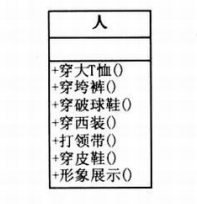
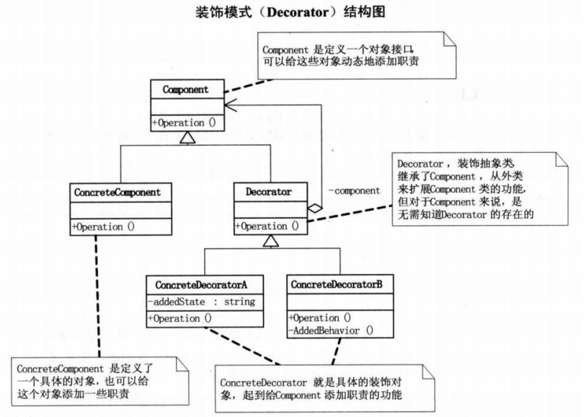
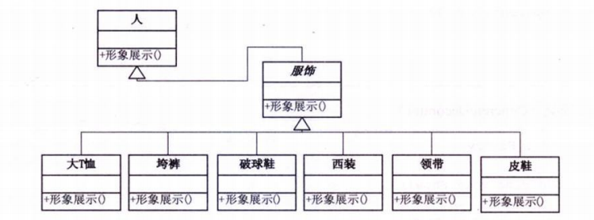

```json
{
  "date": "2021.05.06 12:00",
  "tags": ["sjjg","数据结构","PHP"]
}
```

## 需求
开发一个可以搭配不同服饰的系统
<br />
## 第一版


**Person.php**
```php
<?php


namespace code1;


class Person
{
    private $name;

    public function __construct($name)
    {
        $this->name = $name;
    }

    public function wearTShirts()
    {
        echo "穿了大T恤\n";
    }

    public function wearBigTrouser()
    {
        echo "穿了垮裤\n";
    }

    public function wearSneakers()
    {
        echo "穿了破球鞋\n";
    }

    public function wearSuit()
    {
        echo "穿了西装\n";
    }

    public function wearTie()
    {
        echo "穿了领带\n";
    }

    public function wearLeatherShoes()
    {
        echo "穿了皮鞋\n";
    }

    public function show()
    {
        echo '装扮的' . $this->name;
    }
}
```

**index.php**
```php
<?php
include_once 'Person.php';

use code1\Person;

$p = new Person("张三");

echo "第一种装扮:\n";
$p->wearTShirts();
$p->wearBigTrouser();
$p->wearSneakers();
$p->show();

echo "\n\n---------------\n\n";


echo "第二种装扮:\n";
$p->wearSuit();
$p->wearTie();
$p->wearLeatherShoes();
$p->show();
```
### 代码分析
### 
违背了开放-封闭原则，一旦要添加一个装扮，则需要修改Person类
<br />
## 第二版


**Finery.php**
```php
<?php


namespace code2;

abstract class  Finery
{
    public abstract function show();
}
```
**BigTrouser.php**
```php
<?php


namespace code2;


include_once 'Finery.php';

class BigTrouser extends Finery
{
    public function show()
    {
        echo "穿了大垮裤\n";
    }
}
```
**LeatherShoes.php**
```php
<?php


namespace code2;

include_once 'Finery.php';

class LeatherShoes extends Finery
{
    public function show()
    {
        echo "穿了皮鞋\n";
    }
}
```
**Sneakers.php**
```php
<?php


namespace code2;


include_once 'Finery.php';

class Sneakers extends Finery
{
    public function show()
    {
        echo "穿了破球鞋\n";
    }
}
```
**Suit.php**
```php
<?php


namespace code2;


include_once 'Finery.php';

class Suit extends Finery
{
    public function show()
    {
        echo "穿了西装\n";
    }
}
```
**Tie.php**
```php
<?php


namespace code2;


include_once 'Finery.php';

class Tie extends Finery
{
    public function show()
    {
        echo "穿了领带\n";
    }
}
```
**TShirts.php**
```php
<?php


namespace code2;


include_once 'Finery.php';

class TShirts extends Finery
{
    public function show()
    {
        echo "穿了大T恤\n";
    }
}
```
**index.php**
```php
<?php
include_once 'Person.php';
include_once 'BigTrouser.php';
include_once 'LeatherShoes.php';
include_once 'Person.php';
include_once 'Sneakers.php';
include_once 'Suit.php';
include_once 'Tie.php';
include_once 'TShirts.php';

use code2\BigTrouser;
use code2\LeatherShoes;
use code2\Person;
use code2\Sneakers;
use code2\Suit;
use code2\Tie;
use code2\TShirts;

$p = new Person("张三");

echo "第一种装扮:\n";
(new TShirts())->show();
(new BigTrouser())->show();
(new Sneakers())->show();
$p->show();

echo "\n\n---------------\n\n";


echo "第二种装扮:\n";
(new Suit())->show();
(new Tie())->show();
(new LeatherShoes())->show();
$p->show();
```

### 代码分析
<br />以上的代码实现了基本的搭配，但是就如穿衣服，实际是有一套流程的，此处不应该让用户一件件的选择，而是组装出一套流程，将每个流程串联起来。
<br />
## 装饰模式
### 
定义
动态地给一个对象添加一些额外的职责，就增加功能来说，装饰模式比生成子类更加灵活。
<br />
## 装饰模式样例


**Component.php**
```php
<?php


namespace code3;

/**
 * @desc: 定义一个对象接口，给其他对象动态地添加职责
 */
abstract class Component
{
    public abstract function Operation();
}
```
**ConcreteComponent.php**
```php
<?php


namespace code3;

include_once 'Component.php';

class ConcreteComponent extends Component
{
    public function Operation()
    {
        echo "具体对象的操作\n";
    }
}
```
**ConcreteDecoratorA.php**
```php
<?php


namespace code3;


include_once 'Decorator.php';

class ConcreteDecoratorA extends Decorator
{
    // 区别于B，是A特有的属性
    private $name;

    public function Operation()
    {
        parent::Operation();
        $this->name = "张三";
        echo "具体装饰对象A的操作\n";
        echo "A类独有的属性：" . $this->name . "\n";
    }
}
```
**ConcreteDecoratorB.php**
```php
<?php


namespace code3;


include_once 'Decorator.php';

class ConcreteDecoratorB extends Decorator
{

    public function Operation()
    {
        parent::Operation();
        echo "具体装饰对象B的操作\n";
        $this->func();
    }

    private function func()
    {
        echo "B类独有的方法。。\n";
    }
}
```
**Decorator.php**
```php
<?php


namespace code3;


include_once 'Decorator.php';

class Decorator extends Component
{
    protected $componentObj;

    public function setComponent($componentObj)
    {
        $this->componentObj = $componentObj;
    }

    public function Operation()
    {
        if ($this->componentObj != null) {
            $this->componentObj->Operation();
        }
    }
}
```
**index.php**
```php
<?php

include_once 'ConcreteComponent.php';
include_once 'ConcreteDecoratorA.php';
include_once 'ConcreteDecoratorB.php';

use code3\ConcreteComponent;
use code3\ConcreteDecoratorA;
use code3\ConcreteDecoratorB;

$componentObj = new ConcreteComponent();
$d1 = new ConcreteDecoratorA();
$d2 = new ConcreteDecoratorB();

$d1->setComponent($componentObj);
$d2->setComponent($d1);
$d2->Operation();
```

### 代码分析

<br />装饰模式是利用setComponent来对对象进行包装的。这样每个装饰对象的实现就和如何使用这个对象分离开了，每个装饰对象只关心自己的功能，不需要关心如何被添加到对象链中。
<br />
<br />如果只有一个ConcreteDecorator类没有抽象的Component类，那么Decorator类可以是ConcreteDecorator的一个子类。同样道理，如果只有一个ConcreteDecorator类，那么就没有必要建立一个单独的Decorator类,而可以把Decorator类和ConcreteComponent的责任合并成一个类
<br />
## 第三版

**Finery.php**
```php
<?php


namespace code4;

include_once 'Person.php';

/**
 * @desc: Decorate的身份
 */
class Finery extends Person
{
    protected $componentObj;

    public function decorator($componentObj)
    {
        $this->componentObj = $componentObj;
    }

    public function show()
    {
        if ($this->componentObj != null) {
            $this->componentObj->show();
        }
    }
}
```
**Person.php**
```php
<?php


namespace code4;

/**
 * @desc: ConcreteComponent的角色
 */
class Person
{
    private $name;

    public function setName($name)
    {
        $this->name = $name;
        return $this;
    }

    public function show()
    {
        echo '装扮的' . $this->name . "\n";
    }
}
```
**BigTrouser.php**
```php
<?php


namespace code4;


include_once 'Finery.php';

class BigTrouser extends Finery
{
    public function show()
    {
        echo "穿了大垮裤\n";
        parent::show();
    }
}
```
**LeatherShoes.php**
```php
<?php


namespace code4;

include_once 'Finery.php';

class LeatherShoes extends Finery
{
    public function show()
    {
        echo "穿了皮鞋\n";
        parent::show();
    }
}
```
**Sneakers.php**
```php
<?php


namespace code4;


include_once 'Finery.php';

class Sneakers extends Finery
{
    public function show()
    {
        echo "穿了破球鞋\n";
        parent::show();
    }
}
```
**Suit.php**
```php
<?php


namespace code4;


include_once 'Finery.php';

class Suit extends Finery
{
    public function show()
    {
        echo "穿了西装\n";
        parent::show();
    }
}
```
**Tie.php**
```php
<?php


namespace code4;


include_once 'Finery.php';

class Tie extends Finery
{
    public function show()
    {
        echo "穿了领带\n";
        parent::show();
    }
}
```
**TShirts.php**
```php
<?php


namespace code4;


include_once 'Finery.php';

class TShirts extends Finery
{
    public function show()
    {
        echo "穿了大T恤\n";
        parent::show();
    }
}
```
**index.php**
```php
<?php
include_once 'Person.php';
include_once 'BigTrouser.php';
include_once 'LeatherShoes.php';
include_once 'Person.php';
include_once 'Sneakers.php';
include_once 'Suit.php';
include_once 'Tie.php';
include_once 'TShirts.php';

use code4\BigTrouser;
use code4\LeatherShoes;
use code4\Person;
use code4\Sneakers;
use code4\Suit;
use code4\Tie;
use code4\TShirts;

$p = (new Person())->setname('张三');

echo "第一种装扮:\n";

$sneakerObj = new Sneakers();
$bigTrouserObj = new BigTrouser();
$tShirtsObj = new TShirts();

$sneakerObj->decorator($p);
$bigTrouserObj->decorator($sneakerObj);
$tShirtsObj->decorator($bigTrouserObj);
$tShirtsObj->show();

echo "\n\n------------\n\n";

echo "第二种装扮:\n";
$leatherShoesObj = new LeatherShoes();
$tieObj = new Tie();
$suitObj = new Suit();

$leatherShoesObj->decorator($p);
$tieObj->decorator($leatherShoesObj);
$suitObj->decorator($tieObj);
$suitObj->show();


```

### 代码分析

## 装饰模式总结


1. 装饰模式是为已有功能动态的添加更多功能的一种方式。
1. 当系统需要新功能的时候，是向旧的类中添加新的代码。这些新加的代码通常装饰了原有类的核心职责或者主要行为。但问题在于，往主类添加了新的字段，会增加主类的复杂度。而这些新加入的东西仅仅是为了满足一些只在某种特定情况下才会执行的特殊行为的需求
1. 装饰模式把每个要装饰的功能放在独立的类中，并让这个类包装它所要装饰的对象，因此当需要执行特殊行为时，就可以在运行时根据需要有选择地，按顺序的使用装饰功能包装对象。
1. 由此看来，装饰模式的优点是把类中的装饰功能从类中搬移去除，这样可以简化原有的类。
1. 装饰模式有效的把类的核心职责和装饰功能区分开了，而且可以去除相关类中重复的装饰逻辑
1. 用装饰模式最理想的情况是保证装饰类之间彼此独立，这样他们就可以以任意的顺序来组合了。
