```json
{
  "date": "2021.05.08 12:00",
  "tags": ["sjjg","数据结构","PHP"]
}
```


> 思考：工厂方法模式和简单工厂有什么区别？


## 简单工厂实现

以之前的计算器实现业务来说，简单工厂实现方法如下。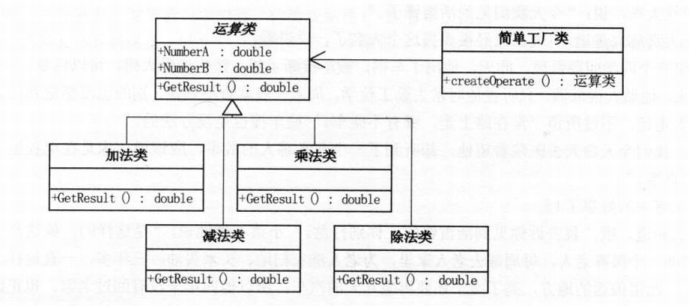

目录结构如下<br />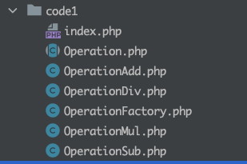

Operation.php
```php
<?php
/**
 * @desc: 运算抽象类
 * @date: 2021/10/19
 */

namespace code1;

abstract class Operation{
    private $numA = 0;
    private $numB = 0;

    public function getNumA(){
        return $this->numA;
    }

    public function setNumA($numA){
        $this->numA = $numA;
    }

    public function getNumB(){
        return $this->numB;
    }

    public function setNumB($numB){
        $this->numB = $numB;
    }

    public abstract function getResult();
}

```

OperationAdd.php（其他运算同理，这里不赘述）
```php
<?php
namespace code1;

include_once 'Operation.php';
/**
 * @desc: 加法运算类
 * @date: 2021/10/19
 */
class OperationAdd extends Operation
{
    public function getResult(){
        return $this->getNumA() + $this->getNumB();
    }
}
```

OperationFactory.php
```php
<?php

use code1\OperationAdd;
use code1\OperationSub;
use code1\OperationMul;
use code1\OperationDiv;

include_once 'OperationAdd.php';
include_once 'OperationDiv.php';
include_once 'OperationMul.php';
include_once 'OperationSub.php';

/**
 * @desc: 运算工厂类
 * @date: 2021/10/19
 */
class OperationFactory
{
    public static function createOperate($operate){
        $opeObj = null;
        switch ($operate){
            case '+':
                $opeObj = new OperationAdd();
                break;
            case '-':
                $opeObj = new OperationSub();
                break;
            case '*':
                $opeObj = new OperationMul();
                break;
            case '/':
                $opeObj = new OperationDiv();
                break;
        }
        return $opeObj;
    }
}
```
index.php
```php
<?php
include_once 'OperationFactory.php';


$numA = $_POST['numA'];
$operate = $_POST['operate'];
$numB = $_POST['numB'];
if (!$numA || !$numB || !$operate) {
    echo '缺少必要参数';
    die;
}
$opeObj = OperationFactory::createOperate($operate);
$opeObj->setNumA($numA);
$opeObj->setNumB($numB);
try {
    $result = $opeObj->getResult();
    echo "结果是" . $result;
} catch (Exception $e) {
    echo 'catch 异常：'.$e->getMessage();
}
```

## 工厂方法实现
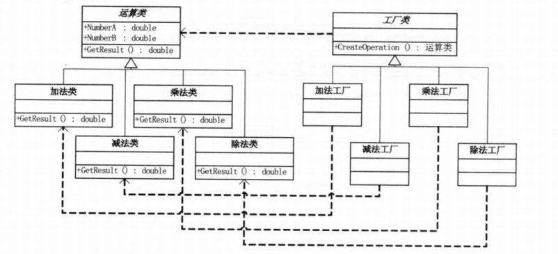

目录结构如下<br />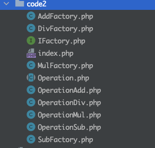

### 先创建一个工厂接口
IFactory.php
```php
<?php


namespace code2;


interface IFactory
{
    public static function CreateOperation();
}
```
### 
### 创建加减乘除的工厂方法
AddFactory.php （其他同理，参考上面目录结构创建）
```php
<?php


namespace code2;


include_once 'IFactory.php';
include_once 'OperationAdd.php';

class AddFactory implements IFactory
{

    public static function CreateOperation()
    {
        return new OperationAdd();
    }
}
```

### 调用形式
index.php
```php
<?php

use code2\AddFactory;

include_once 'AddFactory.php';


$numA = $_POST['numA'];
$numB = $_POST['numB'];
if (!$numA || !$numB) {
    echo '缺少必要参数';
    die;
}
$opeObj = AddFactory::CreateOperation();
$opeObj->setNumA($numA);
$opeObj->setNumB($numB);
try {
    $result = $opeObj->getResult();
    echo "结果是" . $result;
} catch (Exception $e) {
    echo 'catch 异常：'.$e->getMessage();
}
```

## 简单工厂 vs 工厂方法

**如果现在要改需求，比如增加一个“求M数的N次方”功能类。**

### 简单工厂的修改

1. 增加这个类

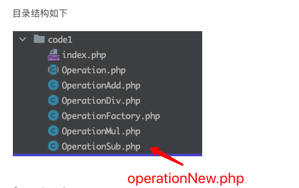

2. 修改工厂类，增加case分支。

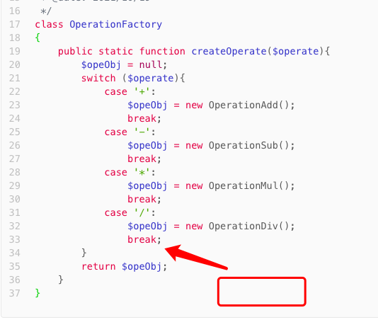 

### 工厂方法的修改

1. 增加这个类

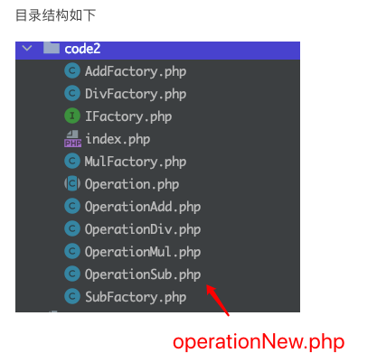

2. 增加对应的工厂类，工厂类调用上面新增的实现方法。

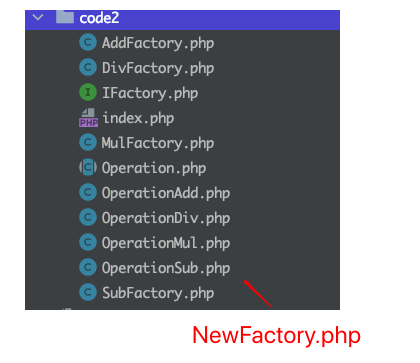

3. 修改客户端，使其上面新的工厂类。

**问题就来了，这看起来不但没有简化难度，反而增加很多类和方法。为什么要这样？**

## 工厂方法和简单工厂的区别

1. 简单工厂最大的优点在于工厂类包含了必要的逻辑判断，根据客户端选择的条件动态实例化相关的类。对于客户端来说，去除与具体产品的依赖。想要加法，传入“+”号。想要减法，传入“-”号。

2. 可这是优点也是缺点，缺点就是违背了开放——封闭原则。如果新增一个新的方法，需要修改关键的工厂类，改其case的条件，这不但对扩展开放了，也对修改开放了。

3. 工厂方法模式：定义一个用于创建对象的接口，让子类决定实例化哪一个类。工厂方法使一个类的实例化延迟到其子类。

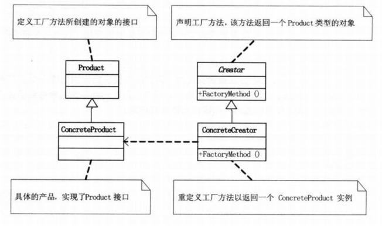

4. 使用工厂方法处理逻辑改变问题，需要修改对应的工厂类，无论增删都不会影响到别的逻辑。完全符合开放-封闭原则精神。

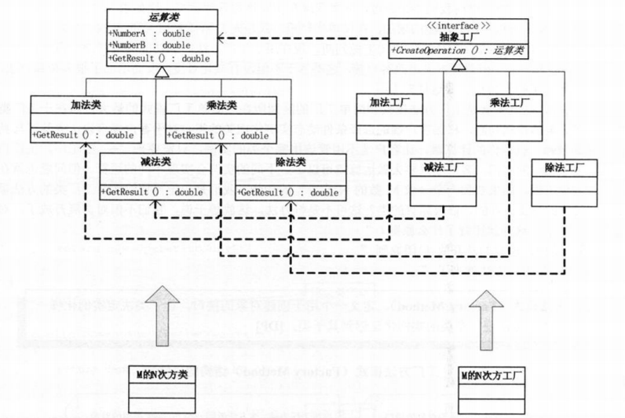

5. 相信你也看出来了，实际工厂方法模式实现时，客户端要决定实例化哪一个工厂来实现运算类，选择判断的问题还是存在，也就是说，工厂方法把简单工厂内部逻辑判断移到了客户端代码来进行，你想要加功能，本来要改工厂类的，现在是修改客户端。

## 简单工厂 vs 工厂方法 案例2
> 现有个场景，把雷锋好人好事封装一个雷锋类，当然学做雷锋的人自然就是实例化的对象。现有一个薛磊风同学和其他三个学生作为大学生，学雷锋做好事，怎么用程序表达这件事。

### 
### 简单工厂实现

目录结构如下<br />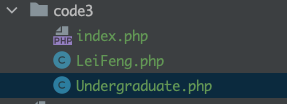

leifeng,php
```php
<?php


namespace code3;


class LeiFeng
{
    public function Sweep()
    {
        echo "扫地\n";
    }

    public function Wash()
    {
        echo "洗衣\n";
    }

    public function BuyRice()
    {
        echo "买米\n";
    }
}
```

Undergraduate.php 
```php
<?php


namespace code3;

include_once 'LeiFeng.php';

class Undergraduate extends LeiFeng
{

}
```

index.php
```php
<?php

use code3\Undergraduate;

include_once 'Undergraduate.php';

$xueLeiFeng = new Undergraduate();

$xueLeiFeng->BuyRice();
$xueLeiFeng->Sweep();
$xueLeiFeng->Wash();


$student1 = new Undergraduate();

$student1->BuyRice();
$student1->Sweep();
$student1->Wash();


$student2 = new Undergraduate();

$student2->BuyRice();
$student2->Sweep();
$student2->Wash();


$student3 = new Undergraduate();

$student3->BuyRice();
$student3->Sweep();
$student3->Wash();
```

> 过了几年，大学生毕业了。他们就不是大学生了，他们是社区志愿者了，但是他们学雷锋的行为仍在继续，此时要如何修改这些变化呢？

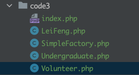

1 . 新增一个志愿者类<br />voluteer.php
```php
<?php


namespace code3;

include_once 'LeiFeng.php';

class Volunteer extends LeiFeng
{

}
```


2. 新增一个雷锋工厂

SimpleFactory.php
```php
<?php


namespace code3;


class SimpleFactory
{
    public static function CreateLeiFeng($type)
    {
        switch ($type) {
            case '学雷锋的大学生':
                return new Undergraduate();
            case '社区志愿者';
                return new Volunteer();
            default:
                return null;
        }
    }
}
```

3. 客户端引入工厂类

index.php
```php
<?php

use code3\SimpleFactory;

include_once 'SimpleFactory.php';

$xueLeiFeng = SimpleFactory::CreateLeiFeng('社区志愿者');

$xueLeiFeng->BuyRice();
$xueLeiFeng->Sweep();
$xueLeiFeng->Wash();


$student1 = SimpleFactory::CreateLeiFeng('社区志愿者');

$student1->BuyRice();
$student1->Sweep();
$student1->Wash();


$student2 = SimpleFactory::CreateLeiFeng('社区志愿者');

$student2->BuyRice();
$student2->Sweep();
$student2->Wash();


$student3 = SimpleFactory::CreateLeiFeng('社区志愿者');

$student3->BuyRice();
$student3->Sweep();
$student3->Wash();
```

**可以看出，如果想修改回大学生类，则需要重新改4次。**<br />SimpleFactory::CreateLeiFeng('社区志愿者');  =>  SimpleFactory::CreateLeiFeng('学雷锋的大学生);

### 工厂方法实现
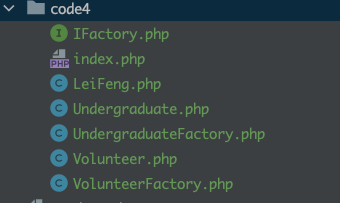

其中Leifeng,php，Undergraduate.php，Volunteer.php没变

IFactory.php 工厂接口类
```php
<?php


namespace code4;


interface IFactory
{
    public function CreateLeiFeng();
}
```

UndergraduateFactory.php 
```php
<?php


namespace code4;


class UndergraduateFactory implements IFactory
{

    public function CreateLeiFeng()
    {
        return new Undergraduate();
    }
}
```

VolunteerFactory.php
```php
<?php


namespace code4;


class VolunteerFactory implements IFactory
{

    public function CreateLeiFeng()
    {
        return new Volunteer();
    }
}
```

index.php
```php
<?php

use code4\UndergraduateFactory;

include_once 'UndergraduateFactory.php';

// 只需要改这里就行了
$factoryObj = new UndergraduateFactory;

$xueLeiFeng = $factoryObj->CreateLeiFeng();

$xueLeiFeng->BuyRice();
$xueLeiFeng->Sweep();
$xueLeiFeng->Wash();


$student1 = $factoryObj->CreateLeiFeng();

$student1->BuyRice();
$student1->Sweep();
$student1->Wash();


$student2 = $factoryObj->CreateLeiFeng();

$student2->BuyRice();
$student2->Sweep();
$student2->Wash();


$student3 = $factoryObj->CreateLeiFeng();

$student3->BuyRice();
$student3->Sweep();
$student3->Wash();
```
## 
**工厂方法克服了简单工厂违背开放——封闭原则的缺点，又保持了封装对象创建过程的优点。**


