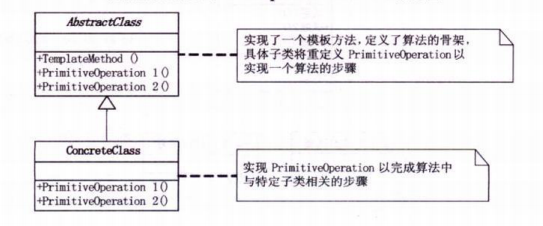

```json
{
  "date": "2021.05.10 12:00",
  "tags": ["sjjg","数据结构","PHP"]
}
```


> 场景：设计一个考试抄试卷的场景，每个作答可以看作是一个类。


## 重复 = 易错 + 难改

学生甲的试卷
```php
<?php


namespace code1;

// 学生甲抄的试卷
class TestPaperA
{
    // 试题1
    public function TestQuestion1()
    {
        echo '杨过得到，后面给了郭靖，炼成倚天剑、屠龙刀的玄铁可能是[ ] a.球磨铸铁 b.马口铁 c.高速合金钢 d.碳素纤维' . "\n";
        echo '答案:b' . "\n";
    }

    // 试题2
    public function TestQuestion2()
    {
        echo '杨过、程英、陆无双铲除了情花，造成[ ] a.使这种植物不再害人 b.使一种珍稀物种灭绝 c.破坏了生物圈的生态平衡 d.造成该地区沙漠化' . "\n";
        echo '答案:b' . "\n";
    }


    public function TestQuestion3()
    {
        echo '蓝凤凰致使华山师徒、桃谷六仙呕吐不止，如果你是大幅，会给他们开什么药 [ ] a.阿司匹林 b.牛黄解毒片 c.氟哌酸 d.让他们喝大量的生牛奶' . "\n";
        echo '答案:C' . "\n";
    }


}
```

学生乙的试卷
```php
<?php


namespace code1;

// 学生乙抄的试卷
class TestPaperB
{
    // 试题1
    public function TestQuestion1()
    {
        echo '杨过得到，后面给了郭靖，炼成倚天剑、屠龙刀的玄铁可能是[ ] a.球磨铸铁 b.马口铁 c.高速合金钢 d.碳素纤维' . "\n";
        echo '答案:d' . "\n";
    }

    // 试题2
    public function TestQuestion2()
    {
        echo '杨过、程英、陆无双铲除了情花，造成[ ] a.使这种植物不再害人 b.使一种珍稀物种灭绝 c.破坏了生物圈的生态平衡 d.造成该地区沙漠化' . "\n";
        echo '答案:b' . "\n";
    }


    public function TestQuestion3()
    {
        echo '蓝凤凰致使华山师徒、桃谷六仙呕吐不止，如果你是大幅，会给他们开什么药 [ ] a.阿司匹林 b.牛黄解毒片 c.氟哌酸 d.让他们喝大量的生牛奶' . "\n";
        echo '答案:a' . "\n";
    }


}
```

### 总结
可以看出两份代码冗余极高，除了答案有区别，其他完全一致。

## 提炼代码

TestPaper.php 试卷问卷部分
```php
<?php


namespace code2;


class TestPaper
{
    // 试题1
    public function TestQuestion1()
    {
        echo '杨过得到，后面给了郭靖，炼成倚天剑、屠龙刀的玄铁可能是[ ] a.球磨铸铁 b.马口铁 c.高速合金钢 d.碳素纤维' . "\n";
    }

    // 试题2
    public function TestQuestion2()
    {
        echo '杨过、程英、陆无双铲除了情花，造成[ ] a.使这种植物不再害人 b.使一种珍稀物种灭绝 c.破坏了生物圈的生态平衡 d.造成该地区沙漠化' . "\n";
    }


    public function TestQuestion3()
    {
        echo '蓝凤凰致使华山师徒、桃谷六仙呕吐不止，如果你是大幅，会给他们开什么药 [ ] a.阿司匹林 b.牛黄解毒片 c.氟哌酸 d.让他们喝大量的生牛奶' . "\n";
    }
}
```

学生甲
```php
<?php


namespace code2;

include_once 'TestPaper.php';

// 学生甲抄的试卷
class TestPaperA extends TestPaper
{
    // 试题1
    public function TestQuestion1()
    {
        parent::TestQuestion1();
        echo '答案:b' . "\n";
    }

    // 试题2
    public function TestQuestion2()
    {

        parent::TestQuestion2();
        echo '答案:b' . "\n";
    }


    public function TestQuestion3()
    {

        parent::TestQuestion3();
        echo '答案:C' . "\n";
    }


}
```

学生乙
```php
<?php


namespace code2;

include_once 'TestPaper.php';

// 学生乙抄的试卷
class TestPaperB extends TestPaper
{
    // 试题1
    public function TestQuestion1()
    {
        parent::TestQuestion1();
        echo '答案:d' . "\n";
    }

    // 试题2
    public function TestQuestion2()
    {
        parent::TestQuestion2();
        echo '答案:b' . "\n";
    }


    public function TestQuestion3()
    {
        parent::TestQuestion3();
        echo '答案:a' . "\n";
    }


}
```

客户端一致，就不赘述了

### 总结
重复部分还是有不少，不重复的部分仅仅是那个答案，其余的都是重复的。想进一步精炼。

## 提炼代码2.0
试卷问卷部分  增加虚方法Answer()
```php
<?php


namespace code3;


class TestPaper
{
    // 试题1
    public function TestQuestion1()
    {
        echo '杨过得到，后面给了郭靖，炼成倚天剑、屠龙刀的玄铁可能是[ ] a.球磨铸铁 b.马口铁 c.高速合金钢 d.碳素纤维' . "\n";
        echo '答案是：' . $this->Answer1() . "\n";
    }

    public function Answer1()
    {
        return '';
    }


    // 试题2
    public function TestQuestion2()
    {
        echo '杨过、程英、陆无双铲除了情花，造成[ ] a.使这种植物不再害人 b.使一种珍稀物种灭绝 c.破坏了生物圈的生态平衡 d.造成该地区沙漠化' . "\n";
        echo '答案是：' . $this->Answer2() . "\n";
    }

    public function Answer2()
    {
        return '';
    }


    public function TestQuestion3()
    {
        echo '蓝凤凰致使华山师徒、桃谷六仙呕吐不止，如果你是大幅，会给他们开什么药 [ ] a.阿司匹林 b.牛黄解毒片 c.氟哌酸 d.让他们喝大量的生牛奶' . "\n";
        echo '答案是：' . $this->Answer3() . "\n";
    }

    public function Answer3()
    {
        return '';
    }

}
```

甲试卷
```php
<?php


namespace code3;

include_once 'TestPaper.php';

// 学生甲抄的试卷
class TestPaperA extends TestPaper
{
    // 试题1
    public function Answer1()
    {
        return 'b';
    }

    // 试题2
    public function Answer2()
    {
        return 'b';
    }


    public function Answer3()
    {
        return 'c';
    }


}<?php


namespace code3;

include_once 'TestPaper.php';

// 学生甲抄的试卷
class TestPaperA extends TestPaper
{
    // 试题1
    public function Answer1()
    {
        return 'b';
    }

    // 试题2
    public function Answer2()
    {
        return 'b';
    }


    public function TestQuestion3()
    {
        return 'c';
    }


}
```
乙试卷
```php
<?php


namespace code3;

include_once 'TestPaper.php';

// 学生乙抄的试卷
class TestPaperB extends TestPaper
{
    // 试题1
    public function Answer1()
    {
        return 'd';
    }

    // 试题2
    public function Answer2()
    {
        return 'b';
    }


    public function Answer3()
    {
        return 'a';
    }


}
```
### 总结
可以看出，每个学生只需回答自己对应的答案即可。实际上，这就是典型的**模板方法模式**。

## 模板方法模式
> 定义一个操作中算法的骨架，而将一些步骤延迟到子类中。模板方法使得子类可以不改变一个算法的结构即可重定义该算法的某些特定步骤。



抽象模板
```php
<?php


namespace code4;


abstract class AbstractClass
{
    // 一些抽象行为，放到子类去实现。
    public abstract function primitiveOperation1();

    public abstract function primitiveOperation2();

    // 模板方法，给出逻辑的骨架，而逻辑的组成是一些相应的抽象操作，它们都推迟到子类实现。
    public function templateMethod()
    {
        $this->primitiveOperation1();
        $this->primitiveOperation2();
    }
}
```

具体实现A
```php
<?php


namespace code4;

include_once 'AbstractClass.php';

class ConcreteClassA extends AbstractClass
{
    public function primitiveOperation1()
    {
        echo '具体A类方法1实现' . "\n";
    }


    public function primitiveOperation2()
    {
        echo '具体A类方法2实现' . "\n";
    }
}
```
具体实现B
```php
<?php


namespace code4;

include_once 'AbstractClass.php';

class ConcreteClassB extends AbstractClass
{
    public function primitiveOperation1()
    {
        echo '具体B类方法1实现' . "\n";
    }


    public function primitiveOperation2()
    {
        echo '具体B类方法2实现' . "\n";
    }
}
```

调用
```php
<?php

use code4\ConcreteClassA;
use code4\ConcreteClassB;

include_once 'ConcreteClassA.php';
include_once 'ConcreteClassB.php';

(new ConcreteClassA())->templateMethod();
(new ConcreteClassB())->templateMethod();
```

### 总结

模板方法模式是通过把不变行为搬移到超类，去除子类中重复代码来体现它的优势。

当不变和可变的行为在方法的子类实现中混合在一起的时候，不变的行为就会在子类中重复出现，我们通过模板方法模式把这些行为搬移到单一的地方，这样就帮助子类摆脱重复的不变行为的纠缠。
