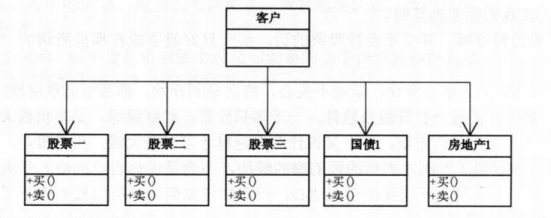
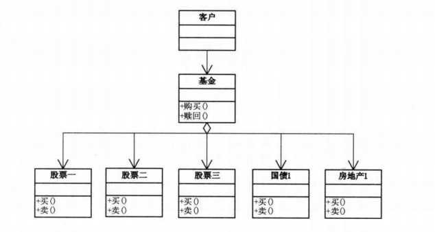

```json
{
  "date": "2021.05.12 12:00",
  "tags": ["sjjg","数据结构","PHP"]
}
```


> 模拟股民买股票的场景，学习外观模式


## 买股票



五个类大同小异，如下
```php
<?php


namespace code1;

// 股票1
class Stock1
{
    public function sell()
    {
        echo '股票1卖出'."\n";
    }

    public function buy()
    {
        echo '股票1买入'."\n";
    }
}
```

调用
```php
<?php

use code1\Stock1;
use code1\Stock2;
use code1\Stock3;
use code1\NationalDebt1;
use code1\Realty1;

include_once 'Stock1.php';
include_once 'Stock2.php';
include_once 'Stock3.php';
include_once 'NationalDebt1.php';
include_once 'Realty1.php';

$gu1 = new Stock1();
$gu2 = new Stock2();
$gu3 = new Stock3();
$nd1 = new NationalDebt1();
$rt1 = new Realty1();

$gu1->buy();
$gu2->buy();
$gu3->buy();
$nd1->buy();
$rt1->buy();

$gu1->sell();
$gu2->sell();
$gu3->sell();
$nd1->sell();
$rt1->sell();

```
### 
## 买基金
> 我们知道，购买一只基金实际就是购买了多只股票，那么如果我们要修改成购买基金，以上代码要怎么修改呢？



fund.php  基金类

```php
<?php


namespace code2;

include_once 'Stock1.php';
include_once 'Stock2.php';
include_once 'Stock3.php';
include_once 'NationalDebt1.php';
include_once 'Realty1.php';

class Fund
{
    private $gu1;
    private $gu2;
    private $gu3;
    private $nd1;
    private $rt1;

    public function __construct()
    {
        $this->gu1 = new Stock1();
        $this->gu2 = new Stock2();
        $this->gu3 = new Stock3();
        $this->nd1 = new NationalDebt1();
        $this->rt1 = new Realty1();
    }

    public function buyFund()
    {
        $this->gu1->buy();
        $this->gu2->buy();
        $this->gu3->buy();
        $this->nd1->buy();
        $this->rt1->buy();
    }

    public function sellFund()
    {
        $this->gu1->sell();
        $this->gu2->sell();
        $this->gu3->sell();
        $this->nd1->sell();
        $this->rt1->sell();
    }
}
```

调用
```php
<?php

use code2\Fund;

include_once 'Fund.php';

$fund = new Fund();

$fund->buyFund();
$fund->sellFund();

```
### 总结
这里的基金购买赎回和外观模式的理念很贴合。购买基金的时候不需要了解买了哪些股票，哪些债券，购买一只基金就相当于买了几只股票。外观模式也是如此，对于一些流程化的步骤，只需要调用外层结构即可。

## 外观模式
**外观模式，为子系统中的一组接口提供一个一致的界面，此模式定义了一个高层接口，这个接口使得这一子系统更加容易使用。**

> 这个模式完美的提现了依赖倒转原则和迪米特法则的思想，是非常常用的模式之一。


## 何时使用外观模式

1. 在设计初期阶段，应该有意识的将不同的两个层分离。比如数据层，业务层，表示层。层与层之间建立外观接口，这样就可以为复杂的子系统提供一个简单的接口。
1. 在开发阶段，子系统往往因为不断的重构演化而变得越来越复杂，增加外观接口可以减少他们之间的依赖。
1. 在维护一个遗留的大型系统时，可能这个系统已经非常难以维护和扩展了。可以用新系统开发一个外观接口，来提供粗糙或高度复杂的遗留代码比较清晰简单的接口，让新系统与外观接口交互，外观接口再与遗留代码交互所有复杂的工作。
