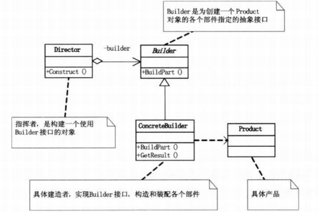

```json
{
  "date": "2021.05.13 12:00",
  "tags": ["sjjg","数据结构","PHP"]
}
```

## 概念



拿画图来举例，画一个小人需要固定的几步：画头，画身体，画左手，画右手，画左腿，画右腿。缺一不可

此处的builder就可以看作建造小人各个部分的抽象类

ConcreteBuilder就可以看作是具体建造者，实现builder接口，构造和装配各个部件。

Product就是具体的产品，比如高的小人，矮的小人。。。

Director就是指挥者，根据用户的需求构建小人对象。

### 定义
将一个复杂对象的构建与它的表示分离，使得同样的构建过程可以创建不同的表示。

### 什么时候用到建造者模式
用于创建一些复杂的对象，这些对象内部构建间的建造顺序通常是稳定的，但对象内部的构建通常面临着复杂的变化。<br />它的好处是使得建造代码和表示代码分离，由于建造者隐藏了该产品是如何组装的，若需要改变一个产品的内部表示，只需要再定义一个具体的建造者即可。


## 代码实现
```php
<?php


namespace code1;


abstract class PersonBuilder
{
    public abstract function buildHead();

    public abstract function buildBody();

    public abstract function buildArmLeft();

    public abstract function buildArmRight();

    public abstract function buildLegLeft();

    public abstract function buildLegRight();
}
```
```php
<?php


namespace code1;

// 指挥者
class PersonDirector
{
    private $builderObj;

    public function __construct($builderObj)
    {
        $this->builderObj = $builderObj;
    }

    // 建造方法，固定了建造的顺序
    public function createPerson()
    {
        $this->builderObj->buildHead();
        $this->builderObj->buildBody();
        $this->builderObj->buildArmLeft();
        $this->builderObj->buildArmRight();
        $this->builderObj->buildLegLeft();
        $this->builderObj->buildLegRight();
    }
}
```
```php
<?php


namespace code1;

include_once 'PersonBuilder.php';

class PersonFatBuilder extends PersonBuilder
{

    public function buildHead()
    {
        echo '实现胖子的头' . "\n";
    }

    public function buildBody()
    {
        echo '实现胖子的身体' . "\n";
    }

    public function buildArmLeft()
    {
        echo '实现胖子的左手' . "\n";
    }

    public function buildArmRight()
    {
        echo '实现胖子的右手' . "\n";
    }

    public function buildLegLeft()
    {
        echo '实现胖子的左脚' . "\n";
    }

    public function buildLegRight()
    {
        echo '实现胖子的右脚' . "\n";
    }
}
```
```php
<?php


namespace code1;


include_once 'PersonBuilder.php';

class PersonThinBuilder extends PersonBuilder
{

    public function buildHead()
    {
        echo '实现瘦子的头' . "\n";
    }

    public function buildBody()
    {
        echo '实现瘦子的身体' . "\n";
    }

    public function buildArmLeft()
    {
        echo '实现瘦子的左手' . "\n";
    }

    public function buildArmRight()
    {
        echo '实现瘦子的右手' . "\n";
    }

    public function buildLegLeft()
    {
        echo '实现瘦子的左脚' . "\n";
    }

    public function buildLegRight()
    {
        echo '实现瘦子的右脚' . "\n";
    }
}
```
```php
<?php

use code1\PersonDirector;
use code1\PersonThinBuilder;
use code1\PersonFatBuilder;

include_once 'PersonThinBuilder.php';
include_once 'PersonFatBuilder.php';
include_once 'PersonDirector.php';


$thinBuilder = new PersonThinBuilder();
$pdThin = new PersonDirector($thinBuilder);
$pdThin->createPerson();


$fatBuilder = new PersonFatBuilder();
$pdFat = new PersonDirector($fatBuilder);
$pdFat->createPerson();

```
