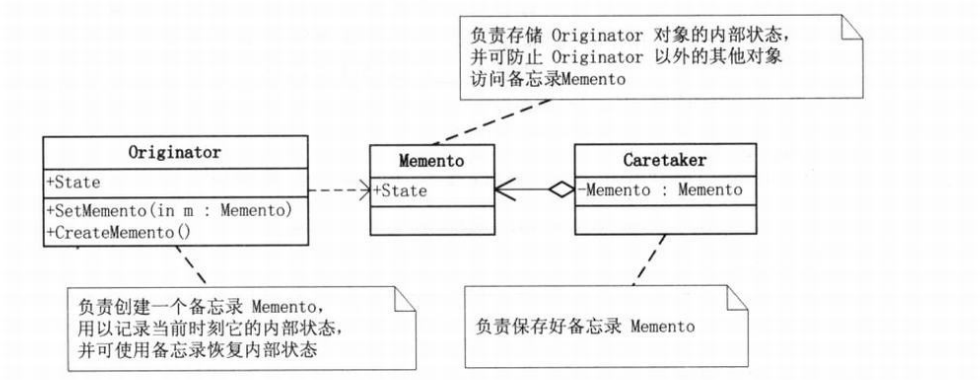

```json
{
  "date": "2021.05.18 12:00",
  "tags": ["sjjg","数据结构","PHP"]
}
```

> 游戏的某个场景，游戏角色有生命力，攻击力，防御力等数据，在打boss前后肯定不一样的，如果我们允许玩家打BOOS后可以随时回到战斗前，要怎么实现呢。用这个案例学习备忘录模式。


## 初步实现

```php
<?php


namespace Part18_MemoMode\Code1;


class GameRole
{
    // 生命力
    private $vitality;
    // 攻击力
    private $attack;
    // 防御力
    private $defense;

    public function getVitality()
    {
        return $this->vitality;
    }

    public function setVitality($vitality)
    {
        $this->vitality = $vitality;
    }

    public function getAttack()
    {
        return $this->attack;
    }

    public function setAttack($attack)
    {
        $this->attack = $attack;
    }

    public function getDefense()
    {
        return $this->defense;
    }

    public function setDefense($defense)
    {
        $this->defense = $defense;
    }

    // 状态显示
    public function StateDisplay()
    {
        echo "角色当前状态：\n";
        echo "体力：{$this->vitality}\n";
        echo "攻击力：{$this->attack}\n";
        echo "防御力：{$this->defense}\n";
        echo "\n";
    }

    // 初始状态
    public function GetInitState()
    {
        $this->vitality = 100;
        $this->attack = 100;
        $this->defense = 100;
    }

    // 打完boss直接死了
    public function Fight()
    {
        $this->vitality = 0;
        $this->attack = 0;
        $this->defense = 0;
    }
}
```
```php
<?php


namespace Part18_MemoMode\Code1;

require_once '../../autoload.php';

$player = new GameRole();

// 初始化角色状态
$player->GetInitState();
$player->StateDisplay();

// 保存进度
$backup = new GameRole();
$backup->setVitality($player->getVitality());
$backup->setAttack($player->getAttack());
$backup->setDefense($player->getDefense());

// 大战boss
$player->Fight();
$player->StateDisplay();

// 恢复之前的状态
$player->setVitality($backup->getVitality());
$player->setAttack($backup->getAttack());
$player->setDefense($backup->getDefense());

$player->StateDisplay();
```
### <br />
### 思考
这样写会把游戏角色的细节暴露给客户端，客户端职责太大，需要知道游戏角色生命力，攻击力，防御力这些细节。如果以后增加新的数据，比如魔法值等，也需要在客户端修改。

我们希望的是把这些”游戏角色“的存取状态细节封装起来，而且最好是封装在外部的类当中，以体现职责分离。

## 备忘录模式

**备忘录模式，是指在不破坏封装性的前提下，捕获一个对象的内部状态，并在该对象之外保存这个状态，这样以后就可以将该对象恢复到原先保存的状态。**



originator（发起人）：负责创建一个备忘录memento，用以记录当前时刻它的内部状态，并可使用备忘录恢复内部状态。originator可根据需要决定memento存储originator的哪些内部状态。

memento（备忘录）：负责存储originator对象的内部状态，并可防止originator以外的其他对象访问备忘录memento。备忘录有两个接口，caretaker只能看到备忘录的窄接口，它只能将备忘录传递给其他对象。originator能够看到一个宽接口，允许它访问返回到先前状态所需的所有数据。

caretaker（管理者）：负责保存好备忘录memento，不能对备忘录的内容进行操作或检查。

```php
<?php


namespace Part18_MemoMode\Code2;

/**
 * 发起人
 */
class Originator
{
    // 需要保存的属性，可能有多个
    private $state;

    public function setState($state)
    {
        $this->state = $state;
    }

    public function getState()
    {
        return $this->state;
    }

    // 创建备忘录，将当前需要保存的信息导入并实例化出一个memento对象
    public function createMemento()
    {
        return new Memento($this->getState());
    }

    /**
     * 恢复备忘录，将memento导入并将数据恢复
     * @param $memento Memento
     */
    public function setMemento($memento)
    {
        $this->state = $memento->getState();
    }

    // 显示数据
    public function show()
    {
        echo "state = {$this->getState()}\n\n";
    }
}
```
```php
<?php


namespace Part18_MemoMode\Code2;

/**
 * 备忘录
 */
class Memento
{
    private $state;

    public function __construct($state)
    {
        $this->state = $state;
    }

    public function getState()
    {
        return $this->state;
    }
}
```
```php
<?php


namespace Part18_MemoMode\Code2;

/**
 * 发起人
 */
class Originator
{
    // 需要保存的属性，可能有多个
    private $state;

    public function setState($state)
    {
        $this->state = $state;
    }

    public function getState()
    {
        return $this->state;
    }

    // 创建备忘录，将当前需要保存的信息导入并实例化出一个memento对象
    public function createMemento()
    {
        return new Memento($this->getState());
    }

    /**
     * 恢复备忘录，将memento导入并将数据恢复
     * @param $memento Memento
     */
    public function setMemento($memento)
    {
        $this->state = $memento->getState();
    }

    // 显示数据
    public function show()
    {
        echo "state = {$this->getState()}\n\n";
    }
}
```
```php
<?php


namespace Part18_MemoMode\Code2;

require_once '../../autoload.php';

// originator初始状态，状态属性为 on
$o = new Originator();
$o->setState('on');
$o->show();

// 保存状态时，由于有了很好的封装，可以隐藏originator的实现细节
$c = new Caretaker();
$c->setMemento($o->createMemento());


// 改变了属性为 off
$o->setState('off');
$o->show();

// 恢复原始状态
$o->setMemento($c->getMemento());
$o->show();


```
### 思考

保存的细节封装在了memento中，要更改保存的细节不需要修改客户端了。

备忘录模式比较适用于功能比较复杂的，需要维护或者记录属性历史的类，或者有需要还原到前一状态的情况。

## 使用备忘录模式实现
```php
<?php


namespace Part18_MemoMode\Code3;


class GameRole
{
    // 生命力
    private $vitality;
    // 攻击力
    private $attack;
    // 防御力
    private $defense;

    public function getVitality()
    {
        return $this->vitality;
    }

    public function setVitality($vitality)
    {
        $this->vitality = $vitality;
    }

    public function getAttack()
    {
        return $this->attack;
    }

    public function setAttack($attack)
    {
        $this->attack = $attack;
    }

    public function getDefense()
    {
        return $this->defense;
    }

    public function setDefense($defense)
    {
        $this->defense = $defense;
    }

    // 状态显示
    public function StateDisplay()
    {
        echo "角色当前状态：\n";
        echo "体力：{$this->vitality}\n";
        echo "攻击力：{$this->attack}\n";
        echo "防御力：{$this->defense}\n";
        echo "\n";
    }

    // 初始状态
    public function GetInitState()
    {
        $this->vitality = 100;
        $this->attack = 100;
        $this->defense = 100;
    }

    // 打完boss直接死了
    public function Fight()
    {
        $this->vitality = 0;
        $this->attack = 0;
        $this->defense = 0;
    }

    /**
     * 新增"保存角色状态"方法，将游戏角色的三个状态值通过实例化"角色状态存储"返回
     */
    public function saveState()
    {
        return new RoleStateMemento($this->getVitality(), $this->getAttack(), $this->getDefense());
    }

    /**
     * 新增"恢复角色状态"方法，可讲外部的"角色状态存储"中的状态恢复给游戏角色
     * @param $memento RoleStateMemento
     */

    public function RecoveryState($memento)
    {
        $this->vitality = $memento->getVitality();
        $this->attack = $memento->getAttack();
        $this->defense = $memento->getDefense();
    }
}
```
```php
<?php


namespace Part18_MemoMode\Code3;

/**
 * 角色状态管理者
 */
class RoleStateCaretaker
{
    private $memento;

    /**
     * @param $memento RoleStateMemento
     */
    public function setMemento($memento)
    {
        $this->memento = $memento;
    }

    public function getMemento()
    {
        return $this->memento;
    }
}
```
```php
<?php


namespace Part18_MemoMode\Code3;

/**
 * 角色状态存储
 */
class RoleStateMemento
{
    // 生命力
    private $vitality;
    // 攻击力
    private $attack;
    // 防御力
    private $defense;

    public function __construct($vitality, $attack, $defense)
    {
        $this->vitality = $vitality;
        $this->attack = $attack;
        $this->defense = $defense;
    }

    public function getVitality()
    {
        return $this->vitality;
    }

    public function setVitality($vitality)
    {
        $this->vitality = $vitality;
    }

    public function getAttack()
    {
        return $this->attack;
    }

    public function setAttack($attack)
    {
        $this->attack = $attack;
    }

    public function getDefense()
    {
        return $this->defense;
    }

    public function setDefense($defense)
    {
        $this->defense = $defense;
    }
}
```
```php
<?php


namespace Part18_MemoMode\Code3;

require_once '../../autoload.php';

$player = new GameRole();

// 初始化角色状态
$player->GetInitState();
$player->StateDisplay();

// 保存进度,由于封装在memento，因此我们并不知道保存了哪些具体的角色数据。
$stateAdmin = new RoleStateCaretaker();
$stateAdmin->setMemento($player->saveState());

// 大战boss
$player->Fight();
$player->StateDisplay();

// 恢复之前的状态
$player->RecoveryState($stateAdmin->getMemento());
$player->StateDisplay();
```
