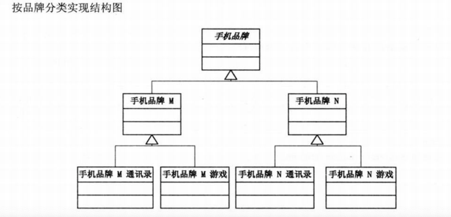

```json
{
  "date": "2021.05.22 12:00",
  "tags": ["sjjg","数据结构","PHP"]
}
```

## 紧耦合的程序演化

### 一个品牌+一个小游戏
> 字面意思，现在有一个N品牌的手机，它有一个小游戏，程序怎么描述？

```php
<?php


namespace Part22_BridgingMode\Code1;

/**
 * N品牌的手机中的游戏
 */
class HandSetNGame
{
    public function run()
    {
        echo "运行N品牌手机游戏\n";
    }
}
```
```php
<?php


namespace Part22_BridgingMode\Code1;


require_once '../../autoload.php';

$game = new HandSetNGame();
$game->run();
```
### 
### 两个品牌+一个小游戏
> 现在增加一个M品牌，同样有一个小游戏，怎么修改？

#### 1. 增加手机游戏抽象类
```php
<?php


namespace Part22_BridgingMode\Code2;

/**
 * 抽象出手机游戏类
 */
abstract class HandsetGame
{
    public abstract function run();
}
```
#### 2. 继承抽象类
```php
<?php


namespace Part22_BridgingMode\Code2;

/**
 * M品牌的手机中的游戏
 */
class HandSetMGame extends HandsetGame
{
    public function run()
    {
        echo "运行M品牌手机游戏\n";
    }
}

/**
 * N品牌的手机中的游戏
 */
class HandSetNGame extends HandsetGame
{
    public function run()
    {
        echo "运行N品牌手机游戏\n";
    }
}
```
### 增加通讯录呢？
> 手机都有通讯录功能，N品牌和M品牌都要增加通讯录的增删改查功能，如何处理？
> 
> 这是不是意味着，N品牌和M品牌都要继承一个手机类。

#### 1. 增加手机品牌抽象类
```php
<?php


namespace Part22_BridgingMode\Code3;

/**
 * 手机品牌
 */
abstract class HandsetBrand
{
    public abstract function run();
}
```

#### 2. M品牌 N品牌继承手机品牌抽象类
```php
<?php


namespace Part22_BridgingMode\Code3;

/**
 * 手机品牌M
 */
class HandsetBrandM extends HandsetBrand
{
    public function run()
    {

    }
}

/**
 * 手机品牌N
 */
class HandsetBrandN extends HandsetBrand
{
    public function run()
    {
        
    }
}
```
#### 3. 手机游戏类继承对应品牌类
```php
<?php


namespace Part22_BridgingMode\Code3;

/**
 * M品牌的手机中的游戏
 */
class HandSetBrandMGame extends HandsetBrandM
{
    public function run()
    {
        echo "运行M品牌手机游戏\n";
    }
}


class HandSetBrandNGame extends HandsetBrandN
{
    public function run()
    {
        echo "运行N品牌手机游戏\n";
    }
}
```
#### 4. 手机通讯录继承对应品牌类
```php
<?php


namespace Part22_BridgingMode\Code3;

/**
 * M品牌的手机中的通讯录
 */
class HandSetBrandMAddressList extends HandsetBrandM
{
    public function run()
    {
        echo "运行M品牌通讯录\n";
    }
}


/**
 * N品牌的手机中的通讯录
 */
class HandSetBrandNAddressList extends HandsetBrandN
{
    public function run()
    {
        echo "运行N品牌通讯录\n";
    }
}
```
#### 5. 调用处
```php
<?php


namespace Part22_BridgingMode\Code3;


require_once '../../autoload.php';

$mAddressList = new HandSetBrandMAddressList();
$mAddressList->run();


$mGame = new HandSetBrandMGame();
$mGame->run();


$nAddressList = new HandSetBrandNAddressList();
$nAddressList->run();


$nGame = new HandSetBrandNGame();
$nGame->run();
```
### 思考
如果每个品牌增加一个MP3功能呢？<br />加子类。。

如果增加一个品牌呢？<br />加新的品牌类，新的功能子类。。

问题出在哪？<br />很多情况下使用继承会带来麻烦。比如，对象的继承关系是在编译时就定义好了，所以无法在运行时改变从父类继承的实现，子类的实现与它的父类有非常紧密的依赖关系，以至于父类实现的任何变化必然会导致子类发生变化，当你需要复用子类时，如果继承下来的实现不适合解决新的问题，则父类必须重写或被其他更适合的类替换。这种依赖关系限制了灵活性并最终限制了复用性。

## 合成/聚合复用原则

**尽量使用合成/聚合，尽量不要使用类继承。**

合成和聚合都是关联的特殊种类。<br />聚合表示一种弱的“拥有”关系，体现的是A对象可以包含B对象，但B对象不是A对象的一部分；<br />合成表示一种强的“拥有”关系，体现了严格的部分和整体的关系，部分和整体的生命周期一样。

### 例子
大雁有两个翅膀，翅膀与大雁是部分和整体的关系，并且他们的生命周期是相同的，于是大雁和翅膀就是合成关系。<br />大雁是群居动物，所以每只大雁都属于一个雁群，一个雁群可以有多只大雁，所以大雁和雁群是聚合关系。

### 好处
优先使用对象的合成/聚合将有助于你保持每个类被封装，并被集中在单个任务上，这样类和类继承层次会保持较小规模，并且不太可能增长为不可控制的庞然大物。


### 应用
放在现在这个例子上，手机是不同的品牌公司，各自做各自的软件，如果我们让其分离与手机的耦合，那么就可以大大减少面对新需求时改动过大的不合理情况。

那么，手机品牌和手机软件之间是什么关系呢？<br />软件并不是品牌的一部分，所以他们之间应该是聚合关系。

## 松耦合的代码
### 手机软件抽象类
```php
<?php


namespace Part22_BridgingMode\Code4;

/**
 * 手机软件抽象类
 */
abstract class HandsetSoft
{
    public abstract function run();
}
```

### 具体软件继承抽象类
```php
<?php


namespace Part22_BridgingMode\Code4;

/**
 * 手机游戏类
 */
class HandsetGame extends HandsetSoft
{

    public function run()
    {
        return "运行手机游戏\n";
    }
}


class HandsetAddressList extends HandsetSoft
{

    public function run()
    {
        return "运行手机通讯录\n";
    }
}
```

### 手机品牌抽象类
```php
<?php


namespace Part22_BridgingMode\Code4;


abstract class HandsetBrand
{
    /**
     * @var HandsetSoft
     */
    protected $soft;

    /**
     * 设置（安装）手机软件
     * @param $soft HandsetSoft
     */
    public function setHandsetSoft($soft)
    {
        $this->soft = $soft;
    }

    // 运行
    public abstract function run();
}
```

### 具体品牌继承抽象类
```php
<?php


namespace Part22_BridgingMode\Code4;

/**
 * 品牌M类
 */
class HandsetBrandM extends HandsetBrand
{

    public function run()
    {
        echo '品牌M：' . $this->soft->run();
    }
}


/**
 * 品牌N类
 */
class HandsetBrandN extends HandsetBrand
{

    public function run()
    {
        echo '品牌N：' . $this->soft->run();
    }
}
```
### 调用处
```php
<?php


namespace Part22_BridgingMode\Code4;


require_once '../../autoload.php';

$nMobile = new HandsetBrandN();
$nMobile->setHandsetSoft(new HandsetGame());
$nMobile->run();

$nMobile->setHandsetSoft(new HandsetAddressList());
$nMobile->run();


$mMobile = new HandsetBrandM();
$mMobile->setHandsetSoft(new HandsetGame());
$mMobile->run();

$mMobile->setHandsetSoft(new HandsetAddressList());
$mMobile->run();


```
### 思考
松耦合的好处在哪呢？

比如现在增加MP3播放，只需要增加一个HandsetMp3类继承HandsetSoft即可。<br />比如现在要增加一个S品牌，只需要增加HandsetBrandS继承HandsetBrand即可。

## 桥接模式
桥接模式，将抽象部分与它的实现部分分离，使它们都可以独立地变化。

### 什么叫抽象与它的实现分离？
不是让抽象类与派生类分离，因为这没有意义，实现的**是抽象类和它的派生类用来实现自己的对象**。<br />通俗点讲，就是**实现系统可能有多个角度分类，每一种分类都有可能变化，那么就把这种多角度分离出来让他们独立变化，减少他们之间的耦合。**

### 结合例子
手机既可以按照品牌来分类，也可以按照软件分类来分类。那么品牌和功能



由于实现的方式有多种，桥接模式的核心就是把这些实现独立出来，让他们各自地变化，这就使得每种实现的变化不会影响其他实现，从而达到对变化的目的。


### 实现代码


```php
<?php


namespace Part22_BridgingMode\Code5;


abstract class Implementor
{
    public abstract function Operation();
}
```
```php
<?php


namespace Part22_BridgingMode\Code5;


class ConcreteImplementorA extends Implementor
{

    public function Operation()
    {
        echo "具体实现A的方法执行\n";
    }
}


class ConcreteImplementorB extends Implementor
{

    public function Operation()
    {
        echo "具体实现B的方法执行\n";
    }
}
```
```php
<?php


namespace Part22_BridgingMode\Code5;


class Abstraction
{
    /**
     * @var Implementor
     */
    protected $implementor;

    /**
     * @param $implementor Implementor
     */
    public function setImplementor($implementor)
    {
        $this->implementor = $implementor;
    }

    public function Operation()
    {
        $this->implementor->Operation();
    }
}
```
```php
<?php


namespace Part22_BridgingMode\Code5;


class RefinedAbstraction extends Abstraction
{
    public function Operation()
    {
        $this->implementor->Operation();
    }
}
```
```php
<?php


namespace Part22_BridgingMode\Code5;

require_once '../../autoload.php';

$ab = new RefinedAbstraction();

$ab->setImplementor(new ConcreteImplementorA());
$ab->Operation();

$ab->setImplementor(new ConcreteImplementorB());
$ab->Operation();

```
