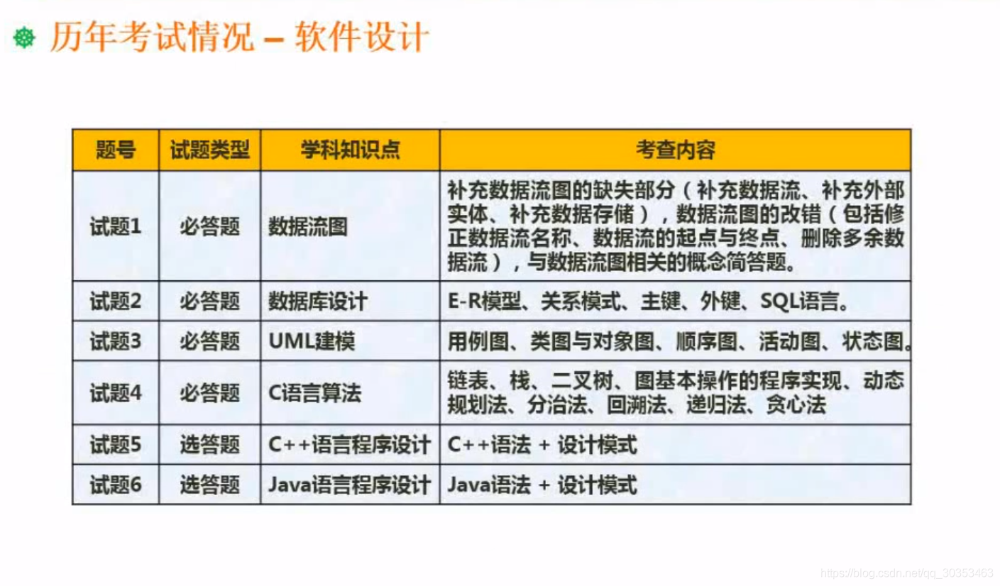

```json
{
  "date": "2021.06.02 11:42",
  "tags": ["rk","软考","软件设计师"]
}
```

软件设计师这个考试，引入到中国已经有多年，最初是由日本引过来的一个考试。

包括软考整个体系都是这个样子的。软件设计师考试的前身呢，叫高级程序员考试。以前是叫高级程序员。

在IT领域的这一个角色分工一步步细化的过程中，就变迁到了软件设计师，把这一个考试级别本身的定位，定位在软件设计这一块。

这考试难度比较大，整个考试的通过率基本是维持在百分之十上下。

很多同学参加这个考试已经有多年的工作经验，也做了多年的开发。才发现呢，其实做题不会做。

这里面有理论和实践，有差距的关系。另外呢，也有一个很重要的因素，软件设计师的考试，考的是广度。而你平时做项目，无论你做了多少项目，你不可能把所涉及到的IT领域的所有知识都囊括进去，你所做的项目，仅仅只是IT领域知识的沧海一粟而已，很小的一块。

而且呢，我们很多时候做项目的规范程度没有达到书上要求的那么高。所以你会发现，我平常不是这么做的，而考试你按你的方式来就不能够得分。

所以说呢，有一定实践经验是好的，但是不能仅凭一些实践经验就能够应对的考试，这也是必然的一点。

所以呢，在这个里面我们不再是希望在整个课程中给大家构建起知识树，还要注意一些方法技巧来应对考试。因为他很多地方考察的点非常的固定，然后呢把这些点给练熟了，相当于你就稳定的把握了一定的分数。然后再来攻其他方面，整个事情就很容易把它搞定。


首先呢，讲一讲这个整个课程的安排，整个课程会按我们自己的编制的这一个讲义的章节来走。这个章节不一定和官方的教材是一一对应的，因为官方教材很多东西写了它不考，也有很多东西考但是它没写，没有涉及到。

所以我们是根据自己的这一个多年的培训的经验总结出来的一套讲义。这讲义按这个思路学习通过考试是没什么问题的。参考书的话呢，主要是一本教程加一本习题集，教程可以用官方的教程。

无论用哪一种教程，我给大家的建议都是，教程只是用来当字典翻的。但真正看书一样样的学的不是那么回事，因为一页页去学这个课程你会学的很艰难，所以整体的一个策略是先建立起响应的知识体系，然后呢再来整知识点。

所谓知识体系是软件设计师会考哪些科目，先画出来。哪一个科目包括哪几个大的知识分块，每一个知识分块常考的点是什么，都要把它标出来。

这样子就说明你有体系了。看到一个题，你知道它在考你哪方面的知识体系，那这个知识体系就基本建成了。

建成了有什么好处呢，你的目标就明确，你的压力就没那么大了。很多同学在应对考试的时候，方法不得当。花很长时间看书，书都看了两遍，花了几个月时间，但是整体效果不好，原因是什么？原因是目标不明确。当你盲目看书的时候，能够吸收的东西及其的有限。你看书的时候啥都懂，看完之后啥都不懂，然后做题的时候容易陷入一种误区，我一套题做下来75分的总分，我得了三十几分，再看一遍书，再做一套题。结果反而只有二十几分，有些人就开始沮丧了，我花了这么长时间，不但没进步，反而退步了。

这又怎么回事呢？这是因为本身知识广度比较大，然后你是从整体去看书。你像做题，如果说把题分到每个知识板块，你就会知道哪一块薄弱需要补，哪一块很擅长你就可以不管它了。所以说，复习的过程中要注意策略，要能够随时做自查，对自己不足的地方想办法把他补充上来。自己已经擅长的就稍微做一下题，通过了就可以了，把时间集中在短板上面，这样子才有效果，你不要说这一次35分，下一次25分，要看35分错了哪里，你懂的哪些问题，25分你又错了哪些，哪些是不该丢分的，要去做这种分析，你才会有提高。

所以整个课程下来，我希望能够建立起大家的只是体系，至于哪一个知识点你不懂，这个很好解决，第一你可以翻教程，第二你可以百度谷歌去找甚至于和别人探讨。但是如果体系没建立起来，往往给人一种感觉是你花了很长的时间但是没有相应的效果。这是很恐怖的一件事。

讲到恐怖是根据幸福曲线来说呢，你付出了很多努力，但是收获不多，你慢慢就会对这件事情失去信心，你会厌恶它，你会希望把它甩得远远的。以考试为例，这个考试考了通过了，对你有好处。你愿意花时间去钻研它，但是钻研的过程中不断的碰壁，你可能会想，这一次可能难过了，下一次我们再努力，这样子心态就不好。一旦出现这种心态，请大家想到我这里说到的幸福曲线，但你厌恶到一定程度，会峰回路转，会找到感觉，大跨步往前面走。


考试大纲的要求，一句话概括，就是IT领域的东西，你或多或少都要知道一些，各个板块它都会考一点，这就是软考的特点，范围极广。所以大纲并不能给我们什么指导，所以我们的这个讲义也是基于历年考试做的综合分析得出来的结论。


考试形式包括两科，都是笔试，上午考计算机与软件工程基础知识，150分钟也就是两个半小时，是75个选择题，每空一分，总分就是75分，合格是45分。

为什么这么奇怪呢？因为他是国外传入的，没有改变它的传统。

第二科呢就是下午考的软件设计，也是150分钟，是问答类型的，其实说问答类型不是很准确。因为它里面包括了问答性质的，包括填空性质，还有填程序性质的题。

对于下午题呢，值得特别说明一点的是，下午的题基本包括一道数据流图的题，第二道数据库的，第三道UML的，第四道是算法这一块的，一般用C语言描述，数据结构这一块的。最后五六二选一，C++和JAVA二选一，面向对象编程。基本上呢以设计模式为背景来考程序设计这一块。

这些题如果给很有开发经验的人来做，如果没有详细准备，他也不能够把他完成。为什么？因为我们开发过程中，很多时候不会做的那么细致，但是考试的时候抠的细节。而真正做项目的时候呢，没有把它做的这么严谨，尤其是国内的这个环境。

还有一部分同学是压根没有项目经验的，拿着这种题更加头痛了。我又没有拿过数据流图做分析，我又没有用过UML，我连ER图就是在大学课程里面学数据库的时候了解过一点而已。那怎么办呢？其实大可不必担心，虽然很多人是下午这一科没过，但是下午题非常有规律，将来会给大家一个个的剖析。

接下来你会发现每一次考试，只要你按我的思路去训练。至少有45分左右的题是可以有把握拿的，其他的题随便拿点分就OK了，即使有些题本身非常难，但某些空也能通过规律找到。所以方法技巧会比实际的经验更重要，所以需要跟着我的思路去走。


这是历年考试情况的分值分布表，表里有平均分数和比例以及常见的考点知识点，那么这个表我不会去讲它，给大家是做什么用的呢？自查用的。

大家看到这个表，可以了解到整个的知识分块。哪些分块考的分值比较高？哪个分块考的分值比较低？第二个当你做完一套题的时候，你要有意识的去分析，自己这套题没有及格，败笔在哪里？哪一块丢分最多。

比如说面向对象的知识，这一套题考了13分，图上写的12分只是平均。有时候13,14分，假如这套题考了13分，那你只做对了3个，那你就应该加强面向对象这一块知识的学习了。这个时候你就可以把书翻出来，有针对性的，具体是面向对象的哪个分块，是设计模式的还是UML的基本概念的，把这一块加强之后。再练下一套题的时候，这里面能拿几分。一定要通过这种方式细化下来，再结合自己的学习方案做调整。

有的同学容易犯的错误是一提到成绩，我这一套题答了45分或者48分，这个我不关心，我关心的是你每个分块情况如何，对于有明显缺漏的部分，你是否真的有花时间去把他补上来，这才重要。
就好像软件的测试，测试的目标不是得到一个评价说，这个软件品质好还是不好，而是找到bug并且修好，以提高软件的品质。

咱们的考试也是应该抱着同样的目的去学习。换句话来讲，你在练习的时候，只答二十三十，但你每次都把错题都搞懂，这样你上考场可能能答四五十。

但如果你每次做的时候，有些题就是靠懵，或者乱填。侥幸答了个四五十，那你考试的时候很有可能犯同样的错误，反而不及格。




软件设计部分几个基本题型这里列出来，至于具体的技巧方法，在讲这个章节的时候会结合例题一一分析剖析。