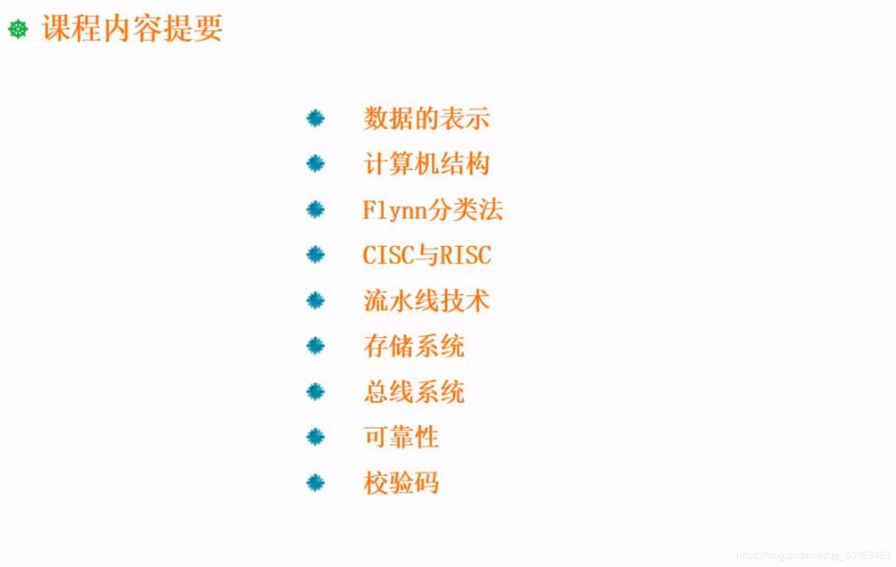

```json
{
  "date": "2021.06.03 20:37",
  "tags": ["rk","软考","软件设计师"],
  "description": "这一部分主要说到软件设计师考试的知识点分布"
}
```

下面我们要学习到的内容是计算机组成原理与体系结构
这一章知识点比较多，同时在考试的时候分值也比较多，占到上午考试六分的比例。
由于上午考察的科目很多，所以六分已经算是比较高的了。


## 数据的表示
首先会考到数据的表示。数据的表示简单一点的，会涉及到进制的转换。我们知道在计算机当中所使用的都是二进制的数据，但是在日常生活中习惯用到的是十进制，为了计算的方便还提出了八进制，十六进制。

在存储体系这一块，有计算我们用多少块芯片组成多大的存储空间。这类问题就需要用到进制的计算。在网络部分去计算ip地址，子网掩码这些数据也会涉及到进制。所以这块进制是为后面的知识做铺垫的。直接考察到的像原码，反码，补码，移码这些，以及浮点运算，这些后面都会讲。

## 计算机结构
计算机结构其实涉及到的内容很多。但是真正考察的比较多的，是CPU当中一些寄存器如何划分的问题。哪些寄存器是放在运算器里面，哪些是属于控制器的寄存器。这些要区分的清楚。对于常见的寄存器，我们还要了解它基本的特性是什么，它是做什么用的。

## Flynn分类法
Flynn分类法提出来很长时间了。是一种对计算机分类的一种方法，这种方法把计算机分成四种大的类别，但真正使用我们会发现没分那么多的类别。有些类别只是理论层面的东西。

## CISC与RISC
CISC与RISC是计算机的指令集。这两种指令集，他们的特点需要区分开。

## 流水线技术
流水线技术主要是考察一些计算方法的问题。

## 存储系统
存储系统既有概念，也有计算方面的问题。

## 总线系统
总线系统主要是要了解总线的分类和概念

## 可靠性
可靠性这一块我们会讲到串联，并联可靠性的计算，以及串并混合的情况。
## 校验码
校验码主要是了解它是有什么作用的。常见的校验码有哪几种。

像CRC校验码，以及海明校验码。他们各自会有什么特点，他们运算过程，编码解码过程又是怎么样的。
