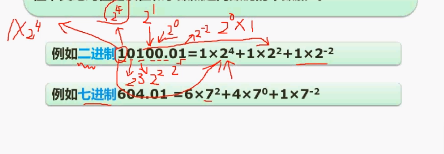
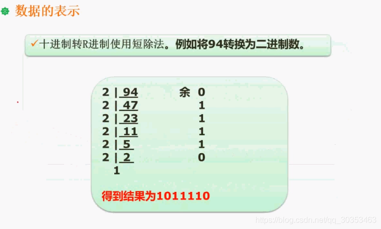
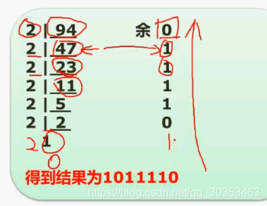

```json
{
  "date": "2021.06.03 22:06",
  "tags": ["rk","软考","软件设计师"],
  "description": "这篇文章介绍了X进制转十进制的按权展开法，十进制转X进制的短除法"
}
```


## X进制转十进制  按权展开法

首先我们要看数据表示的小的知识点，就是不同进制之间的转换问题。

像任何进制转十进制的时候，基本上采用的方法都是按权展开法。

> 拆分每个位置的数，把每个位置的数和它自己的权相乘


首先看到是二进制。二进制只有0和1两种数字。
如图把10100.01二进制转成十进制，
小数点左边第一个数，代表2º。
小数点左边第二个数，代表2¹。
小数点左边第三个数，代表2²。
小数点左边第四个数，代表2³。
小数点左边第五个数，代表2⁴。
这就是每个位数的权值。这个权值代表如果这个位置出现一个1，比如2⁴位置出现了一个1，它所代表十进制的值就是 1 X 2⁴。如果2º出现一个1，那么就代表 1 X 2º。



小数点左边的是0，1，2，3这样依次上去。
小数点右边的分别是
小数点右边第一个数，代表2的-1次方。
小数点右边第一个数，代表2的-2次方。
以此类推。。。

我们只需要按权展开，把每个位置上的值乘以它的权重，最后相加即可。
对于0的位置是不需要乘权重的，因为0乘任何数结果都是0。

第一个1是2⁴，第二个1是2²，第三个1是2的-2次方。把他们相加就能转换成十进制。

同样道理，如果是七机制转十进制同理。我们只需要把2改成7就行了。底数就是代表多少进制。如果是十六进制转十进制，底数就是十六。任何进制转十进制都是如此。

## 十进制转X进制 短除法

如上图将94转为二进制，则需要除数为2
用94除以2 商是47 余0
用47除以2 商是23 余1
用23除以2 商是11 余1
用11除以2 商是5 余1
用5除以2 商是2 余1
用2除以2 商是1 余0
当商是1的时候 就可以停止了 然后逆序得出二进制数 1011110
这就是94所对应的二进制数

如果十进制转16进制则除以16
如果十进制转8进制则除以8

## 二进制快速转八进制与十六进制

计算机要用到的都是二进制，但是运算起来十分烦杂。因为二进制数很长，同样的表述一个十进制数，二进制要比八进制长3倍，比十六进制长4倍。

二进制转八进制和十六进制有十分严谨的对应关系。

### 二进制转八进制

每三个二进制可以对应一个八进制位。比如 10001110
则从右往左每三个划分一个段，分别是 10  001  110
其中第一个10需要在首位补0凑成 010
010转成2
001转成1
110转成6
因此二进制10001110是八进制216

### 二进制转十六进制
同理，转成十六进制则是4个数一端。同样10001110转成十六进制就分成了2端
1000和1110
1000是十六进制的8
1110是十六机制的E（8+4+2=14  =>  E）
因此10001110是十六进制的8E

为什么会十六进制有字母呢？因为十六进制数在9之后就没法用数字表示了，因此10用A表示，11用B表示，12用C表示，13用D表示，14用E表示，15用F表示。


