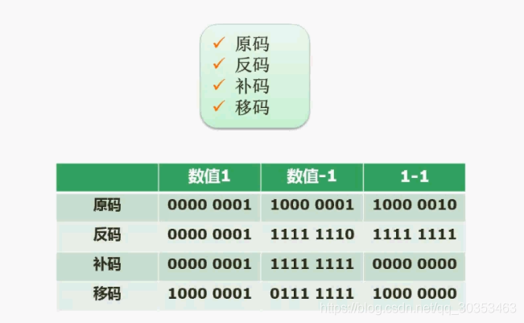
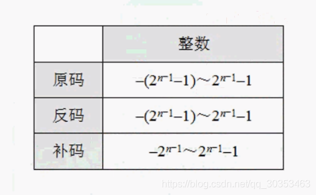

```json
{
  "date": "2021.06.05 15:20",
  "tags": ["软件设计师"],
  "description": "这篇文章介绍了二进制数对应的原码，反码，补码，移码的取值方法"
}
```

在计算机中使用到的编码和我们日常生活到的数据，会有一点的区别。
计算机当中用到的编码：原码，反码，补码，移码。

## 原码
一般来说我们会规定用多少位存储一个二进制数，如图是八位。
1. 把数转成二进制数
2. 首位填充对应的符号，如果是正数则是0，如果是负数则是1

因此
+1的原码是  0000 0001
-1的原码则是 1000 0001

那么我们尝试将两个原码相加，1+（-1），则会出现
0000 0001 + 1000 0001 结果等于 1000 0010 （-2）
很显然，二进制不能直接用原码做运算。

## 反码
1. 正数的反码和原码一致
2. 负数的反码需要保持符号位不变，将其他所有位按位取反，原来是1改0，原来是0改1

因此
+1的反码是 0000 0001
-1的反码是 1111 1110

那么我们尝试将两个反码相加，1+（-1），则会出现
0000 0001 + 1111 1110 = 1111 1111  （ 此时得到的是结果的反码 ）
将1111 1111的符号位不变，后面的位数按位取反，得到原码是 1000 0000 （-0）

## 补码
1. 正数的补码和原码一致
2. 负数的补码需要在反码基础上加1 

因此
+1的补码是 0000 0001
-1的补码是 1111 1111

那么我们尝试将两个补码相加，1+（-1），则会出现
0000 0001 + 1111 1111 = 0000 0000 （此时得到的是结果的补码）
由于符号位是0 因此可以判断原码也是 0000 0000 （+0）

## 移码
移码是在补码基础上 符号位取反

**为什么要这么做呢？**
在补码中，负数的最高符号位是1，而正数却是0，就会有一种负数看起来比正数还大的感觉。如果反过来则比较符合正常的思维了。

1. 正数的移码是 符号位置为1，其余不变
2. 负数的移码是求出补码，把符号位置为0

因此
+1的移码是 1000 0001
-1的移码是   0111 1111


#  数值表示范围



如果1个字节8个位表示的原码，反码，补码的取值范围，根据公式得出

原码是： -（2^7^-1）~ 2^7^-1   =>  -127~127
反码是： -（2^7^-1）~ 2^7^-1   =>  -127~127
补码是： -2^7^~ 2^7^-1   =>  -128~127

**为什么补码比原码，反码多了一个取值呢？**
+0和-0的原码，反码表示方法不一样
用补码表示则是
+0 =》 0000 0000 （正码，反码，补码均是这个）
-1 =》 1111 1111（反码）=》 +1变补码 =》 0000 0000（补码）

可以看出来 0000 0000 即是 +0的补码，也是-0的补码。