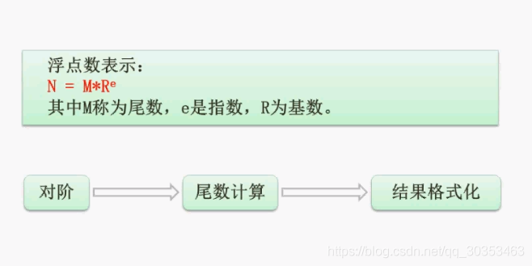

```json
{
  "date": "2021.06.05 15:35:58",
  "tags": ["rk","软考","软件设计师"],
  "description": "这篇文章介绍了浮点数的运算"
}
```


浮点数其实就是我们之前学的科学技术法。
1000可以表示为1.0X10^3^

例如1000 + 119
1000是 1.0X10^3^ ，其中1.0是尾数，3是指数，10是基数
119是 1.19X10^2^，其中1.19是尾数，2是指数，10是基数

**1.0X10^3^+1.19X10^2^ 要怎么运算呢？**
1. 对阶。原则是低阶转成高阶，此处1.19X10^2^ 要转成 0.119X10^3^
2. 尾数计算。此时两个加数的指数都是3了，则计算1.0+0.119=1.119
3. 结果格式化。判断1.119X10^3^是否符合科学计数法。规范是尾数需要大于0小于10，此时是符合的，则不需要变化。假如计算出来结果是11.2X10^3^，则需要格式化成1.12X10^4^。

