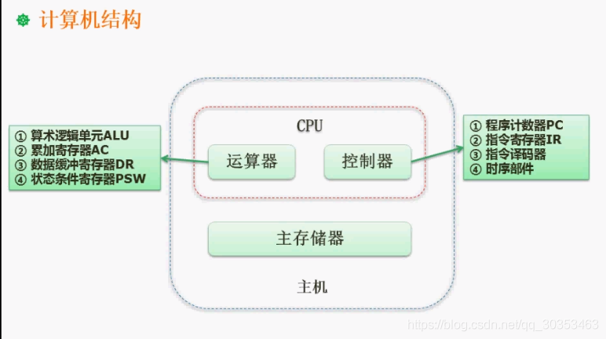

```json
{
  "date": "2021.06.05 16:20",
  "tags": ["软件设计师"],
  "description": "这篇文章介绍了计算机中运算器与控制器的组成"
}
```


主机是计算机结构的核心部分，它并不是我们日常说的主机箱。

主机包括**CPU**和**主存储器**。
像硬盘，声卡，显卡都归为外设。

考试中运算器和控制器的构成是很重要的考点。

## 运算器 
1. 算术逻辑单元。 职能是要做运算，比如加法减法。
2. 累加寄存器。是个通用寄存器，运算过程中存储运算数的值。
3. 数据缓冲寄存器。对内存储器进行读写操作，用来暂存数据。
4. 状态条件寄存器。存储运算过程中相关标志位。运算有时候涉及到进位，溢出，中断。用于暂存状态信息的。


## 控制器 
运行程序时，需要调取相应的指令内容，需要控制，因此和指令有关的往往是控制相关的。
1. 程序计数器。运行下一条指令，要了解下一条指令在什么位置。
2. 指令寄存器。
3. 指令译码器。
4. 时序部件。