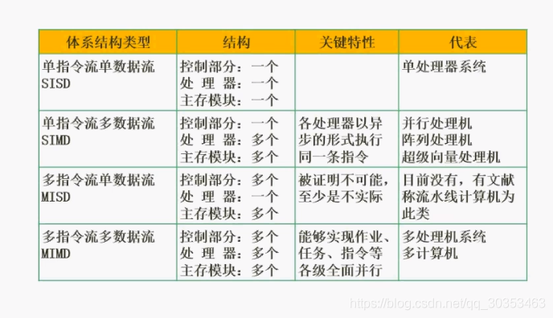

```json
{
  "date": "2021.06.05 16:30",
  "tags": ["软件设计师"],
  "description": "这篇文章介绍了flynn分类法"
}
```



flynn分类法是一种计算机体系结构的一种分类方法。
分类依据是**指令流**和**数据流**。

由于有两个维度分类，因此会有四个分类类型。

一般考试会给你具有代表性的问你属于哪种类型。

## 单指令流单数据流  
比较老式的电脑，目前比较少有。多见于单片机。

## 单指令流多数据流
多见于阵列处理机，考试会以此为代表。
阵列处理机它适合于处理数组类型的运算，比如二维数组，对数组和数组之间操作，会对很多数据进行同样的操作，比如加法，对应的加。此时一条加法指令，通过输入不同的数据，得到一组不同的结构。

## 多指令流单数据流
属于理论模型，并不具备实际意义。

## 多指令流多数据流
目前最常见。
多个计算机连起来形成集群共同完成任务。
多处理器的计算机也属于。


