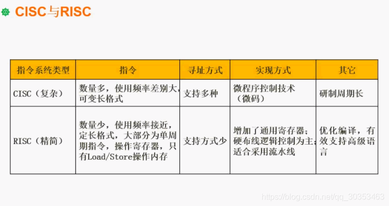

```json
{
  "date": "2021.06.05 16:49",
  "tags": ["rk","软考","软件设计师"],
  "description": "这篇文章介绍了CISC与RISC的区别"
}
```


这个知识点多出在选择题。需要掌握两种不同指令类型的区别。

CISC是以前提出来比较常用的指令系统，是在计算机还没大规模通用化的时候提出来的。在这个时候，计算机属于奢侈品。比如一个机构需要计算机。此时需要找到厂商为我们定制一台计算机，这台计算机从硬件到指令系统都是定制的，往往能达到一间房子那么大。比如用来处理天气预报的功能，就会按需搭配硬件以及构造程序。

CISC会根据不同的用户做不同的指令，并且指令的数量相当多。系统相当复杂。

一开始计算机是各个单位的专用设备，后来计算机只需要安装软件即可运行，因此人们就希望精简指令系统以达到更好的兼容。稍微复杂一点的指令都会被替代成多个简单指令。

因此CISC中指令多就很好理解了。另外指令里肯定会存在使用频率高的和使用频率的，因此使用频率差别会很大。使用的是可变长的指令。

RISC为了提升效率，大量的引入了寄存器，绝大部分都针对寄存器操作，因为寄存器速度极快。硬布线逻辑控制效率会更高。支持高级程序语言。是当代指令系统的主流。