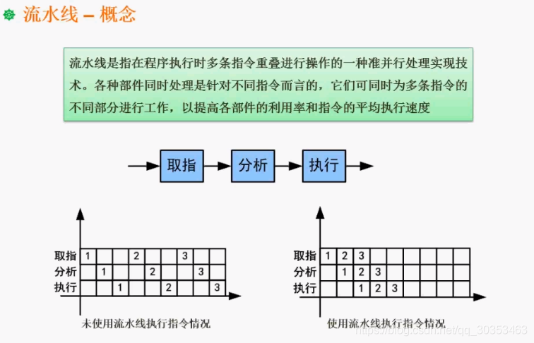

```json
{
  "date": "2021.06.05 17:11",
  "tags": ["软件设计师"],
  "description": "这篇文章介绍了流水线的基本概念"
}
```


流水线基本必考。考察内容是计算问题。

## 什么是流水线？
以上例题假设 我们执行一个指令，会分为取指，分析，执行三个步骤，并且每个步骤执行时间都是 T。

**左图**展示了在没有使用流水线的时候，按时间顺序会执行以下操作：
1. 指令1的取指操作
2. 指令1的分析操作
3. 指令1的执行操作
4. 指令2的取指操作
5. 指令2的分析操作
6. 指令2的执行操作
7. 指令3的取指操作
8. 指令3的分析操作
9. 指令3的执行操作

执行了9个单位时间。 总时长是9T。

**右图**展示了在使用流水线之后，按时间顺序执行了以下操作
1. 指令1的取指操作
2. 指令1的分析操作+指令2的取指操作
3. 指令1的执行操作+指令2的分析操作+指令3的取指操作
4. 指令2的执行操作+指令3的分析操作
5. 指令3的执行操作

执行了5个单位时间，总时长是5T。


**不用流水线时间浪费在了哪里？**
由于取指，分析，执行是在三个不同的部件完成。
所以细化来看，有大量部件的时间是在空闲状态的。在指令1完成取指操作后，处于空闲状态（空白格子）。
同样的道理，分析和执行都是空闲了大量时间。

## 题外话
在工业领域第一次应用工业技术是福特公司做汽车。
原本是分班组，一个班组负责把一台汽车装配完。
福特老板发现在这个车组装过程中，有大量人处于休息状态，
比如有些人只装配发动机，他在装的时候，装玻璃的人在休息。当他装好之后，直到汽车生产完成他都在休息。造成了人工的浪费。
于是优化成了当今的流水线技术。流水线把汽车在传送带传送，装发动机的人一直在装发动机，装玻璃的人也能一直装玻璃。
