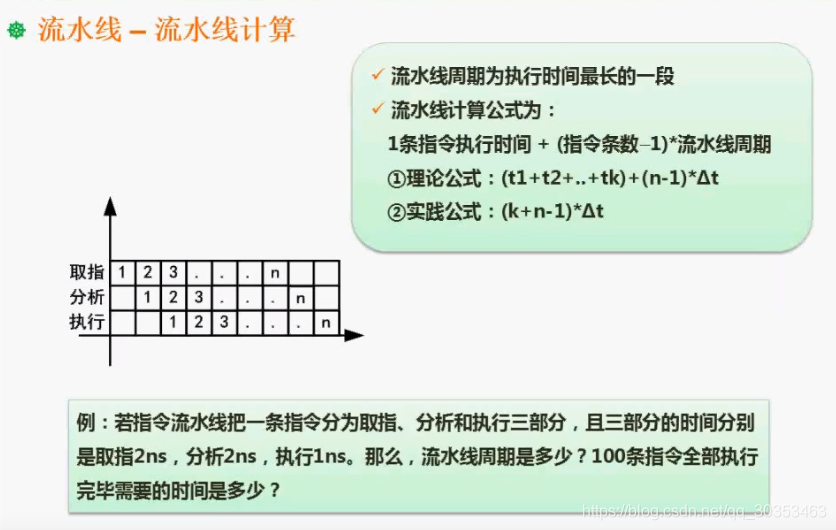
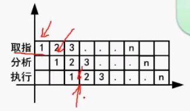
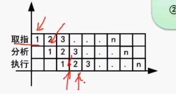
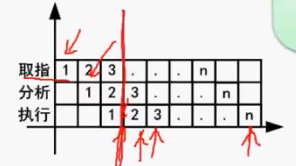

```json
{
  "date": "2021.06.05 19:50",
  "tags": ["rk","软考","软件设计师"],
  "description": "这篇文章介绍了流水线的周期以及流水线执行时间计算"
}
```



## 流水线执行时长的计算

### 流水线周期
流水线周期为执行时间最长（最耗时）的一段。
比如此处例题，取指2ns，分析2ns，执行1ns。因此流水线周期是2ns。

### 全部执行完毕所需的时间

1. 先假设每个流程的时间一致，都是流水线周期。
2. 在箭头处消耗了3个流水线周期，完成了一条指令。

3. 第二个箭头处再消耗一个流水线周期，完成了两条指令。
4. 依次类推。以后的指令都只多花费一个周期。

1. 因此我们可以将他们分成两部分。竖线前面的是流水线的建立部分，有运转时间的时间。
2. 计算的时候就是  **一条指令的执行时间 （运转时间） + 剩余指令数 X 流水线周期**

### 计算的两套方案
**为什么会有两套方案呢？**
因为第一条指令的执行时间计算是有争议的。

#### 理论公式
理论上来说，顺势执行一条指令，流水线就建立起来了。
此处第一条指令的时间是： 2+2+1 = 5ns
剩余时间则是 （100-1）X 2 = 198ns
总时间则是 5+198 = 203ns

#### 实践公式
实践起来，实际不工整的时间片非常小。因此把每个指令步骤都按流水线周期来算。
总时间则是  2 + 2 + 2 + （100 - 1） X 2 = （100 + 3 - 1 ） X 2 = 204ns

**考试的时候用哪个呢？**
80%用的是理论公式，20%用实践公式。当理论公式算出来的值不存在，再选实践公式。
