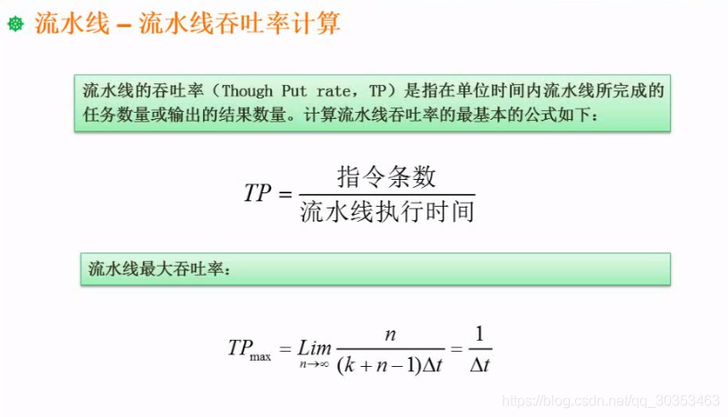
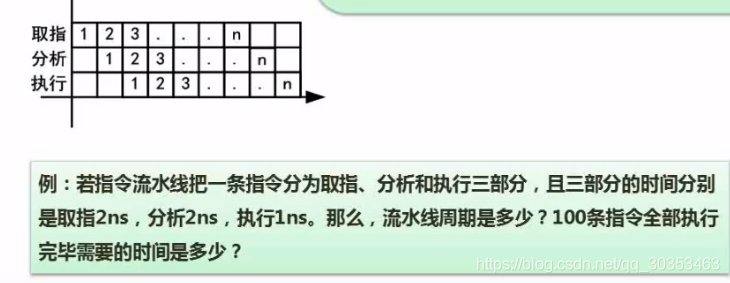
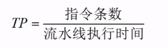
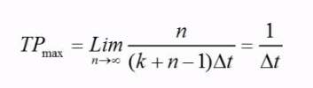

```json
{
  "date": "2021.06.07 19:57",
  "tags": ["软件设计师"],
  "description": "这篇文章介绍了流水线的吞吐率计算"
}
```



## 吞吐率
是指单位时间内流水线所完成的任务数量或输出的结果数量。






上图为例。 指令条数 = 100，流水线执行时间 = 203

吞吐率 = 100/203 
#### 最大吞吐率
理想状态的情况。忽略流水线建立时间，建立之后每个流水线周期就能完成一个指令的运行。
上述例子 = 1 / 2