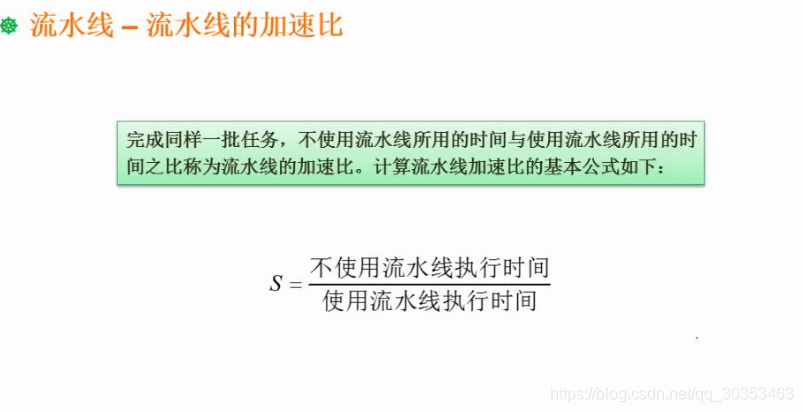
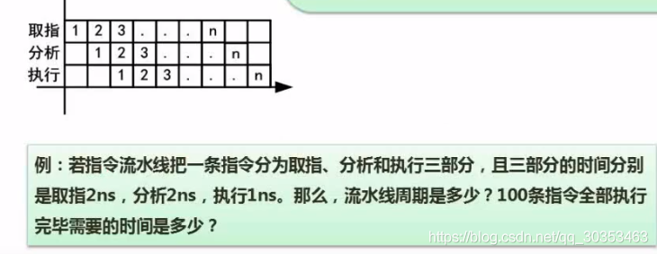
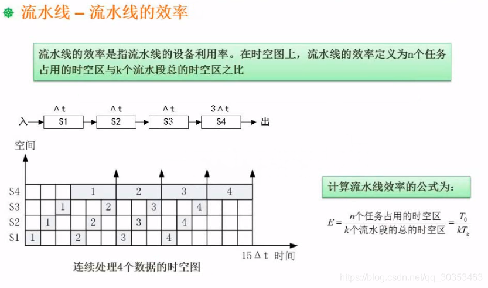

```json
{
  "date": "2021.06.07 20:29",
  "tags": ["软件设计师"],
  "description": "这篇文章介绍了流水线的加速比计算"
}
```


## 流水线的加速比
完成同样一批任务，不使用流水线所用的时间与使用流水线的时间之比。


**不采用流水线需要花费的时间** 
一条指令需要花费 2+ 2 + 1 =5 因此 5 *100 = 500
**采用流水线需要花费 203**
加速比 = 500/203

加速比越高越好。


## 流水线的效率
流水线的效率是指流水线的设备利用率。

假设需要完成的任务分成了4步。其中S1-S3都是 t。S4是3t。流水线周期应该阿是3t。

有图可以看出，虽然用到了流水线技术，但是还是存在浪费掉的时间。

效率 = 阴影空间（实际用到的时间） / 总空间 （总时间）

阴影空间（实际用到的时间）t + t + t + 3t = 6t X 4 = 24t
总空间  15t X 4  = 60

效率 = 24/60 = 40%

由此看来，这个例题的流水线效率不高。

### 流水线如何提高效率
每个工作段的时间基本一致。连接紧密，没有空余空间。