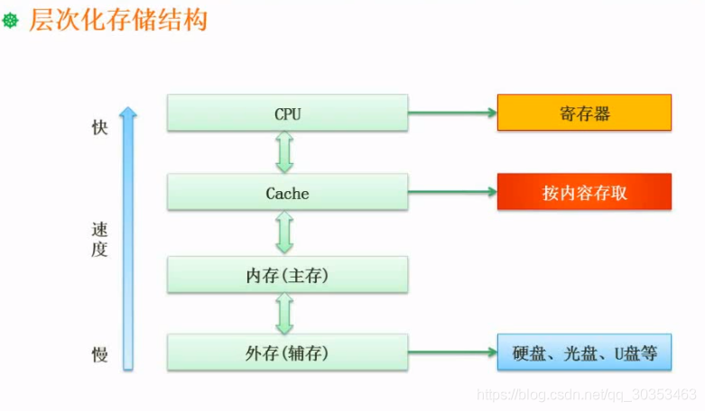

```json
{
  "date": "2021.06.07 20:27",
  "tags": ["rk","软考","软件设计师"],
  "description": "这篇文章介绍了计算机层次化存储结构的特点及优化应用"
}
```




### 寄存器
1. 速度最快，效率最高。
2. 存在于CPU中，CPU有运算器和控制器，运算器和控制器中有相应的寄存器。
3. 容量极小。


### 存储结构的特点
1. 图中可见。从上到下容量逐渐增大，速度逐渐变慢。
2. 容量大的会慢，快的会容量小。这是基于**性价比**的考虑。假如存储结构只有寄存器和cache这种高速存储器，成本是难以接受的。反之速度也接受不了。

### 如何性价比高的提高性能
1.虽然 cache不是必须的，但是拿掉了之后速度极慢。拿掉之后会慢上百倍。因此一般配k级别，最高也是M级别。而内存往往能达到G级别。
2. cache存到 内容是来自内存的一部分内容。因为他们相差了单位级别。
3. 利用局部性原理。程序的执行往往不会只执行一次，当指令执行完一次，再次执行相同块的内容，这就是时间局部性。比如循环结构，循环执行一百万次，循环体要执行一百万次，但实际初始化语句和输出结果的语句只执行一次，此时把循环体语句调入到cache中，CPU和cache交互速度就会比CPU和内存交互快得多。
4. 内存和外存也是这个原理。外存要调用的内容放到内存就会得到性能的提升。
5. 引入cache的效果是成本无需增加过多，但性能提升明显。
6. cache是按内容存取，他比按地址存取快得多。

