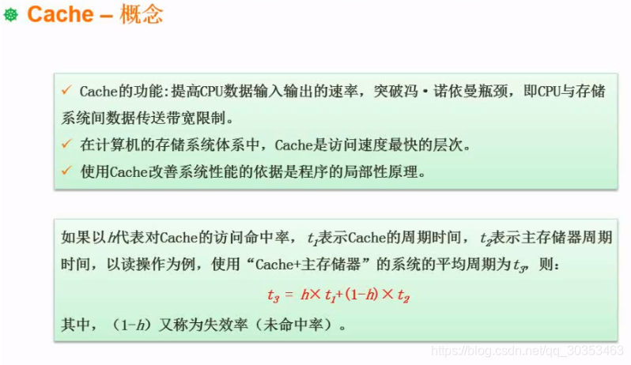

```json
{
  "date": "2021.06.07 20:38",
  "tags": ["软件设计师"],
  "description": "这篇文章介绍了cache的基本概念"
}
```



**cache工作于CPU和内存之间。它是为了提高访问速度而提出来的设计方案。**

**除了寄存器，cache是最快的。**

**寄存器容量极少，有时候甚至不会当成顶级存储器来看待。**

**如果考试问到以下存储结构最快的是？ 有寄存器就选寄存器，没有则是cache。**


## cache的命中率
在多级存储体系结构中，CPU在处理某个数据时，会先读取cache。如果cache有，则称为命中。如果cache没有，则去找内存。
命中率则是读cache能命中的概率是多少

## cache+内存的平均周期计算
举个例子。
t1表示cache的周期时间，假设是1ns。
t2表示内存的周期时间，往往会比cache慢很多倍。假设是1ms（1000ns）
h表示访问cache的命中率，假设为95%

如果说仅仅只用cache，这时候系统的存储周期就是1ns.
如果说仅仅只用内存，这时候系统的存储周期就是1ms
如果两者结合，这时候存储周期则是 1ns X 95% + 1ms  X 5% = 50.95ns

可以发现两者结合速度从1ms提升到50.95ns，提升近20倍。
