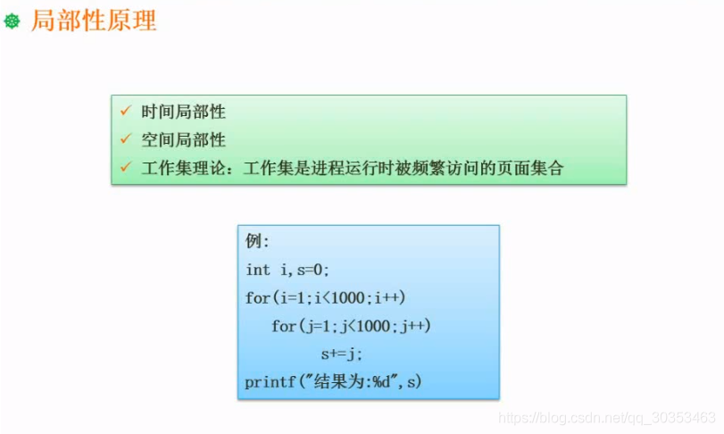
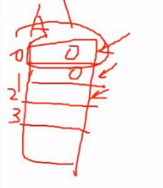

```json
{
  "date": "2021.06.08 19:44",
  "tags": ["rk","软考","软件设计师"],
  "description": "这篇文章介绍了局限性原理"
}
```



## 局部性原理
计算机在处理相关数据时，一般会有某个时段集中访问某些指令或者访问某些空间的数据。

为了在多级存储体系处理速度和成本之间的矛盾。得到最佳性价比。

如上例题。
int i,s=0;  只执行一次
s+=j;  总共要执行1000X1000次。

时间局部性就是上一次访问过的数据，这一次直接读取cache中的数据，达到速度的提升。

空间局部性在数组方面体现的比较直观。

一个数组A，顺次下来A[0]，A[1]，A[2]。。。每个空间都要初始化为0，当程序访问当前空间，再访问临近的空间则是空间局部性。
