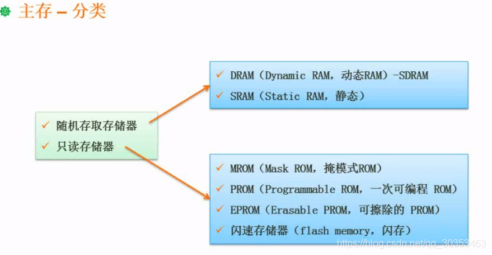
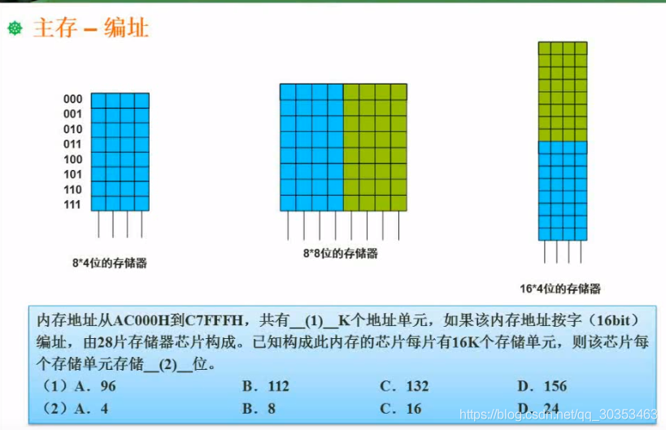

```json
{
  "date": "2021.06.08 20:14",
  "tags": ["rk","软考","软件设计师"],
  "description": "这篇文章介绍了随机存取存储器与只读存储器的区别"
}
```


主存可分为**随机存储器(RAM)** 和**只读存储器（ROM）**。

常见的内存是RAM。特点是一旦断电，内存的所有内容都会丢失。

只读存储器在断电后不会丢失信息。



上述例子中
8*4位的存储器： 8代表有八个地址空间，4代表每个地址空间存储了bit位信息。比如000有四个地址，001，010。。

如果用8*4位的存储器组成 8*8位的存储器，只需要如图2连接即可。

如果用8*4位的存储器组成16*4位的存储器，只需要如图3连接即可。

上题（1）
1. C7FFFH - AC000H +1 = C8000H - AC000H =  1C000H
2.  转换成k，要除以1024 （1k = 1024 bit）
3. 1024转成二进制等于 100 0000 0000，再次转成十六进制则是 400H （不懂看回  2.02 数据的表示）
4. 相当于 1C000H / 400H = 1C0H / 4H (同时去掉后面的0) 
5. （方法1，直接除）以上结果 = 70H （注意哦，这里是十六进制，1C = 16+12=28，相当于28 / 7=4，直接除尽了） 70H = 7*16 = 112（十六进制转十进制）
6. （方法2，转十进制再除） = （1 X 16 ^2^ + 12 * 16^1^ + 0）  / 4 =  448 / 4 = 112 

上题（2）
总的容量 = 112k X 16bit
设每个存储单元存储 Y 位，总的容量 = 28片 X 每片16K个存储单元 X Y位
因此  Y = （112 X  16） /  (28 X 16) = 4  