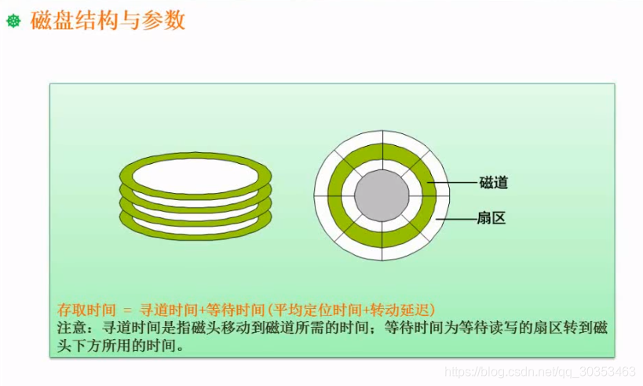
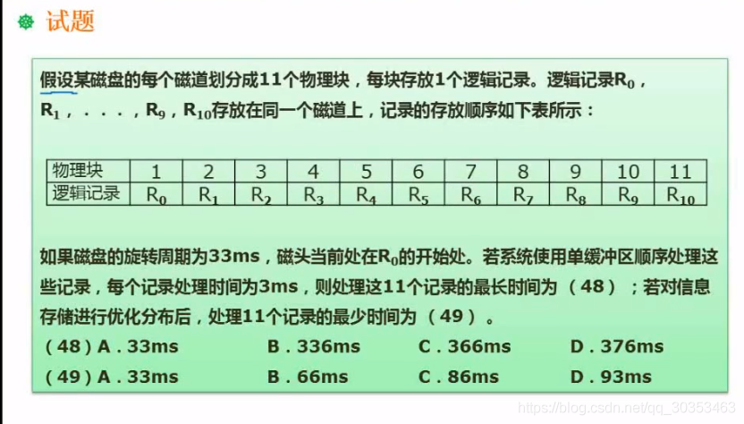
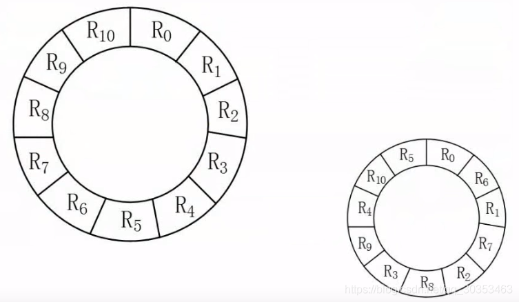

```json
{
  "date": "2021.06.08 20:48",
  "tags": ["rk","软考","软件设计师"],
  "description": "这篇文章介绍了磁盘工作原理"
}
```



主要考到两方面： 磁盘要做哪些动作，哪里需要消耗时间


分析题意： 
此处的物理块就是上面的扇区。

###  第一个空
1. 单缓存区意味着R0读取到缓存区后，磁头到达R1后，此时不能读取数据，因为R0在缓存区还没处理完数据。因此磁头会继续往前走，等到R0在缓存区处理完了，磁头已经到了R2，所以磁头需要再次回到R1开始位置才能处理R1的数据。后面依次类推，R2，R3。。都会多转一圈。
2. 由于磁头是匀速旋转的。题意得知转一圈33ms，共有11个记录，则读取（经过）一个记录要3ms。
3. 因此推断出 处理完 R0 整个步骤：**读取R0记录（3ms）** + **缓冲区处理（3ms）**  +  **转10格回到R1起点（3ms X 10）** 到达R1开始处 
4. 依次类推，R0到R9都是如此。此时共花费了 **（ 3 + 3 + 30） X 10 = 360 ms**
5. 当R10处理完之后，此时不用再转一圈了，而是 读取R10记录（3ms） + 缓冲曲处理（3ms） = 6ms
6. 总时间 = 360 + 6 = 366 ms


### 第二个空
1. 如果优化磁块分布，则如右图。则可以缓冲区一处理完立即可以处理下一个数据。
2. 这样 处理完R0整个步骤： **读取R0记录（3ms）** +  **缓冲区处理（3ms）**
3. 依次类推，R0到R10都是如此。总时间  = **（3+3）X 11 = 66ms**