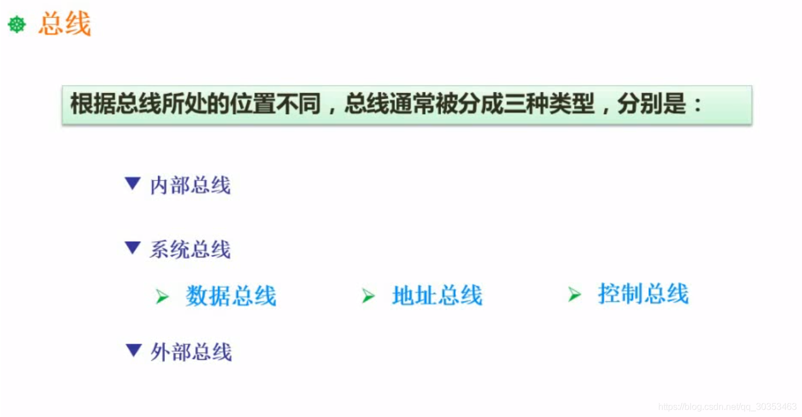

```json
{
  "date": "2021.06.12 11:18",
  "tags": ["软件设计师"],
  "description": "这篇文章介绍了计算机总线"
}
```



## 内部总线
微机内部各个外围的芯片与处理器之间的总线。芯片级别的

## 系统总线
微机中各个插线板和系统板之间的总线。插线板级别的。

### 数据总线
传输数据用的。如果是32位的计算机代表一个字是32个bit位，代表总线的宽度就是32bit位。一个周期能够传输的数据量就是32个bit位。

### 地址总线
假如地址总线是32位，说明代表的地址空间是2^32^，也就是4G的宽度。
往往我们需要用到的内存超过4G，就要考虑32位以上的系统，否则管理不到这么多内存。

### 控制总线
发送相应的控制信号的总线。

## 外部总线
微机和外部设备的总线。