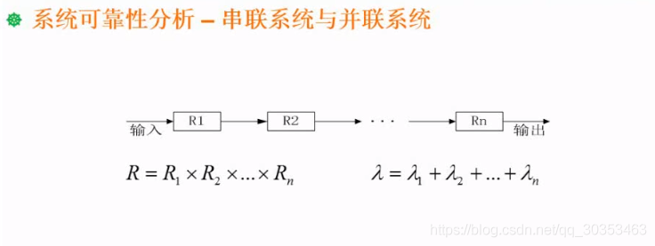
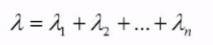
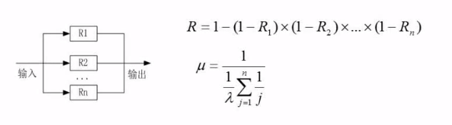
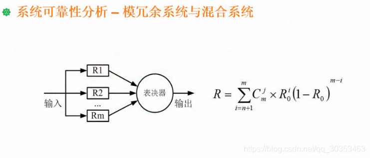
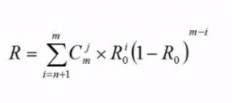
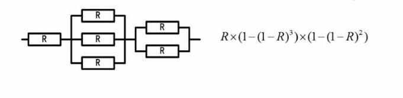

```json
{
  "date": "2021.06.12 11:47",
  "tags": ["rk","软考","软件设计师"],
  "description": "这篇文章介绍了串联系统和并联系统的可靠度计算"
}
```



## 串联模型
如上图，N个子系统串在一起形成一个系统。所有的子系统都必须正常运行，整个系统才正常，只要有一个环节出问题了，整个系统就会出问题。

#### 串联模型可靠度计算
R = R1 X R2 X R3 X ... X Rn
比如R1,R2,R3都是0.9，则R=0.9^3^ = 72.9%

#### 串联模型失效率计算

失效率有可能是会大于1的，它只是一个简化公式，当失效率极低的时候可以快速计算结果。


## 并联系统
并联系统很显然是有多个系统并联在一起。多个子系统只要有一个能正常运行，系统就能正常运行。换句话说，只有全部子系统都出问题，则系统出问题。
#### 并联系统可靠度计算
思路是计算全部子系统出问题的概率，得出不出问题的概率。
设R1是子系统1的可靠度，则失效是 1 - R1

R = 1 - （1-R1）x （1-R2） x （1-R3）.. x （1-Rn）
比如R1,R2,R3均为0.1 则 R = 1-0.1^3^ = 99.9%


## 模冗余系统
提高系统可靠性可以用冗余的方式进行。
如上图，R1，R2。。。Rn都做同样的计算，系统最终通过表决决定采纳哪个结果。
假设R1得到结果是1，R2也是1，R3得到0，通过表决器，输出应该是1，1占多数。此处的R3相当于出故障了，但是不会影响整个系统的运行。

### 模冗余系统可靠性计算

几乎不会考到，放心。

## 串联并联混合系统

如上图，先判断他大体是串联还是并联。可以看出这个系统可以看分成3份独立系统的串联，大结构是串联，小结构是并联的系统。
1. 算出第二个系统的可靠度 1-（1-R）^3^
2. 算出第三个系统的可靠度 1-（1-R）^2^
3. 用串联公式计算整体可靠度 R X (1-（1-R）^3^) x (1-（1-R）^2^)