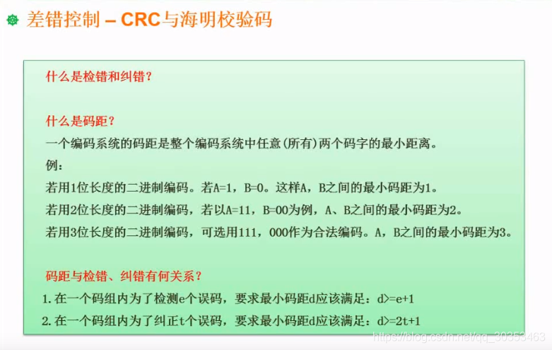

```json
{
  "date": "2021.06.12 13:16",
  "tags": ["rk","软考","软件设计师"],
  "description": "这篇文章介绍了检验码的概念"
}
```



## 什么是检错和纠错？
检错就是检查出错误
纠错是不但要检查处错误，并且纠正

## 如何实现？
加一些冗余信息实现，这就是校验码。

## 什么是码距？
整个编码系统中任意两个码字的最小距离。通俗点讲，就是改变多少个位可以成为另一个码。

**若用1位长度的二进制编码，A=1，B=0，这种情况能不能检错呢？** 
不能。我发了个1，结果传输出现了问题，传到你那里成了0，你就不知道这个0是传错了还是传输错误了，因为0和1都是正确的码。

**为了解决上述问题，增加码距，用2位长度的二进制编码，A=11,B=00，此时能不能检错？能不能纠错？**
能检错，如果发的是11，传到之后错了（10，01，但是一般不会两个都错，出现00概率极少，不考虑），此时就能发现错误，因为正常只有11和00。
但是无法纠错，如果传错成为10，它可能是11传过来的，也可能是00传过来的。

**为了纠错，增加到3位长度的二进制编码，A=111,B=000，原理是什么？**
如果发的是111，变成了110.那么就可以看出是原本是111的。
因为前提是在计算机出现两位以上的错误概率几乎可以忽略。

## 码距与检错，纠错有什么关系？
1. 为了检测e个错误码，要求最小码距是： d>=e+1
2. 为了纠正t个错误码，要求最小码距是： d>=2t+1