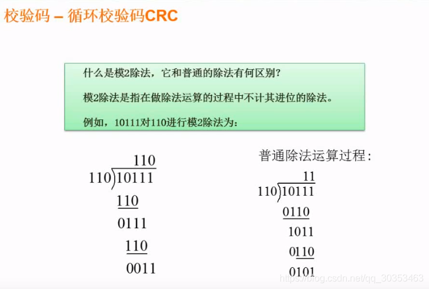

```json
{
  "date": "2021.06.12 19:56",
  "tags": ["软件设计师"],
  "description": "这篇文章介绍了循环校验码"
}
```


## 模2除法

模2除法是指在做除法运算的过程中不计其进位的除法。

1. 注意把110放到101下面后，不是101-110，而是做异或操作。相同值置为1，不同值置为0。
2. 比如101和110的异或结果是011。1和1结果是0，0和1结果是1，1和0结果是1。


## 校验码CRC
**可以检查，但不能纠错的一种编码。**

1. 此处的 x^4^ + x^3^ + x + 1 意思是除数在第4，3，1，0位都是1，写成二进制数是11011，也就是除数。
2. 接下来用 11001010101 后面加若干个0（生成多项式位数 - 1），此时位数是5，也就是要补4个0。
3. 然后用110010101010000 与 11011 模2除法，得到余数0011。
4. 把0011替换成刚刚的0000，得出结果 110010101010011。
5. 此时的结果 110010101010011 与 11011模2计算，结果自然就是0。