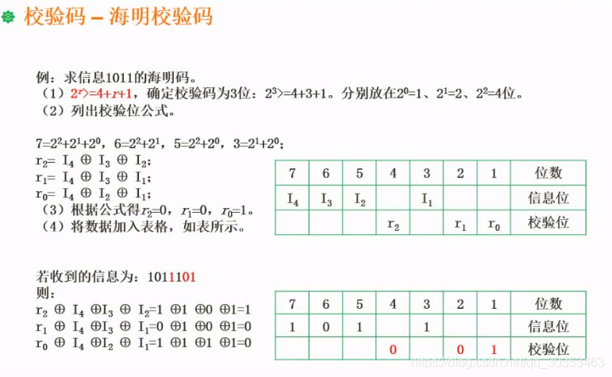
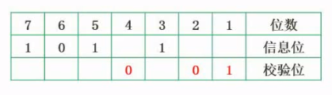
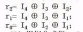

```json
{
  "date": "2021.06.12 20:39",
  "tags": ["软件设计师"],
  "description": "这篇文章介绍了海明校验码"
}
```


## 海明校验码
需要了解海明码的编码规则，要会计算需要多少位校验位。

### 海明码的编码规则
校验位： 校验位的位置是有规律的。都是位于2^n^。
比如2^0^(1),2^1^(2),2^2^(4)。。都是校验位。

信息位：不是校验位的其他位置。

**举个例子**
**当信息位有1位，编码长度是多少。**
由于1，2都是校验位，信息位只能放到位置3，因此长度是3。

**当信息位有2位，编码长度是多少。**
由于1，2，4都是校验位，信息位只能放到位置3，5，因此长度是5。

**当信息位有5位，编码长度是多少。**
由于1，2，4，8都是校验位，信息位只能放到位置3，5，6，7，9，因此长度是9。

这个客观规律用数学公式总结
X是信息位长度，r是校验位个数，得出 **2^r^ >= X+r+1**


**题型1：16位长度的信息位至少需要多少个校验位？**
假设校验位长度是4，代入公式 2^r^ = 2^4^ = 16 ， X+r+1 = 16+4+1 = 21，16<21，因此不成立，要往后推断。
假设校验位长度是5，代入公式 2^r^ = 2^5^ = 32 ， X+r+1 = 16+5+1 = 22，32>22，不等式成立，因此结果就是5。

### 海明码的计算
**题型2：求信息1011的海明码**
1. 用上述公式推断出是3位检验位。
2. 把信息位填充到对应的位数，当然校验位可以用R0，R1，R2代替，如下图。

3. 复杂的是如何计算R0，R1，R2的值，也就是为啥等于1，0，0

4. 由于I4=7 = 2^2^ + 2^1^ + 2^0^，因此第7位的这个信息位会影响到R0，R1，R2。
5. 由于I4=6 = 2^2^ + 2^1^，因此第6位的这个信息位会影响到R1，R2。
6. 由于I2=5 = 2^2^ + 2^0^，因此第5位的这个信息位会影响到R0，R2。
7. 由于I1=3 = 2^1^ + 2^0^，因此第3位的这个信息位会影响到R0，R1。
8. 把影响到的对应代入公式，比如 r2 = I4异或I3异或I2，得出r2=0，r1=0，r0=1。
9. 得到海明码为 1010101

**海明码除了能检错，还能纠错。**
比如接收到的是1011101，就相当于r2=1，r1=0，r0=1

1. 根据信息位算出真实的校验码为r2=0，r1=0，r0=1 （上述方法）
2. 然后把接收到的校验位与真实校验位进行异或操作，就可以得出r2是错的，因为异或结果等于1。取反就能纠错了。