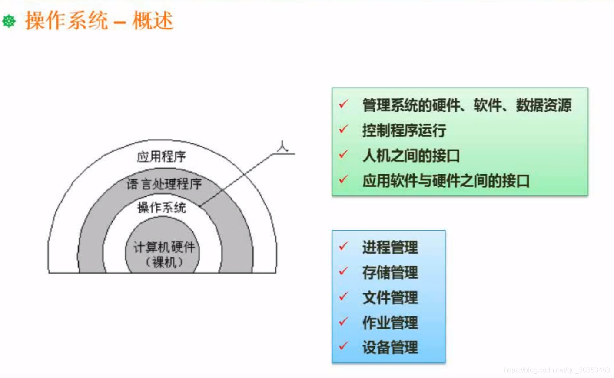
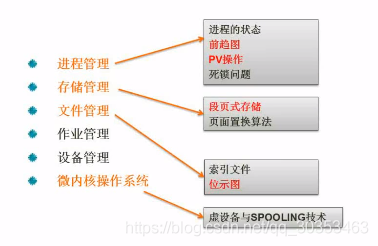

```json
{
  "date": "2021.06.13 11:42",
  "tags": ["软件设计师"],
  "description": "这篇文章介绍了操作系统"
}
```


1. 操作系统是用来管理整个系统的软硬件资源。如果买来一台计算机没有装操作系统，是无法控制资源的。
2. 操作系统是人和硬件之间的接口。我们可以点击鼠标，往硬盘里面存放数据，把一些数据读取出来等。其他的应用软件，像office办公软件，也是工作于操作系统之上的。
3. 接口往往是命令，人需要去学习命令的使用。windows系统是图形化的，但无论哪种都是人机之间的接口


