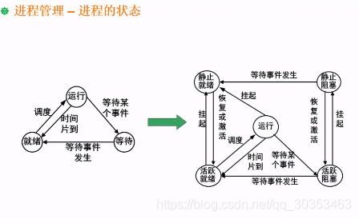

```json
{
  "date": "2021.06.13 12:00",
  "tags": ["rk","软考","软件设计师"],
  "description": "这篇文章介绍了进程状态转换图"
}
```


进程状态是指操作系统中对进程进行管理时，为进程指定了几种状态。以便于给进程分配相应的资源。

**最初只分了运行，等待，就绪三种状态。**
运行态指的是这个进程所需要的所有资源都已经配足了，并且给它CPU资源，此时就属于运行状态。
就绪态指的是其他所有资源，只缺CPU资源，这种状态是一种万事俱备只欠东风的状态。
等待态指的是缺其他资源，也没CPU资源，与外设有交互，或者等待指令之类的状态。

**三态转换关系**
1. 运行状态一旦缺某种资源，就进入了等待状态。
2. 等待状态下获取到了某种资源，就会进入就绪状态。
3. 注意，等待状态不能进入运行状态。这意味着就算你资源获取足够了，你也得乖乖去排队，去到就绪状态，等CPU资源分配。
4. 就绪状态排队的时候，等CPU给到资源，就可以进入到运行状态。
5. 进入运行状态不见得就能完成所有的任务，因为CPU资源相当宝贵，大家都需要获取。往往是就绪到运行只运行一个时间片的时间，等到时间片结束了，此时就会进入等待态。

但是三种状态不足以涵盖现实的各种情况，比方人为的管控进程，挂起进程。于是有了五种状态。
五态下的**活跃就绪态**即是三态中的**就绪态**。**活跃阻塞态**就是三态中的**等待态**。

**五态转换关系**
1. 增加了一种挂起操作，但是运行状态并且人为挂起时，就会进入到静止就绪态。
2. 当静止就绪态恢复或激活，就重新进入到活跃就绪态。
3. 活跃阻塞也可以挂起进入到静止阻塞。
