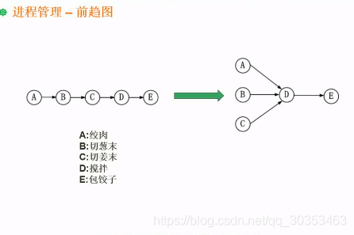
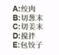
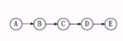
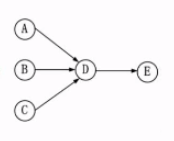

```json
{
  "date": "2021.06.13 12:26",
  "tags": ["软件设计师"],
  "description": "这篇文章介绍了前驱图"
}
```


**举个例子**
过年包饺子吃，包饺子有多个工序。有绞肉，切葱末，切姜末，切好之后各种调料进行搅拌，最后才是包饺子。



如果要完成这些步骤，当然是可以顺序操作，一步一步来，没有问题。如下图所示


但是实际是一起操作这些事情的，这时候就要考虑完成这些事情的先后顺序，哪些事情是可以并行做的。

但此时表达的是我只能先绞肉，再切葱末。而不能先切葱末，再绞肉，这显然不合理。

**实际我们想要表达的逻辑是怎么样的呢？**
1. 绞肉，切葱末，切姜末其实是可以并行操作的
2. 搅拌则是需要前面三项工作完成才能进行
3. 包饺子则要等搅拌完成才能进行

用前驱图表达就是下图

