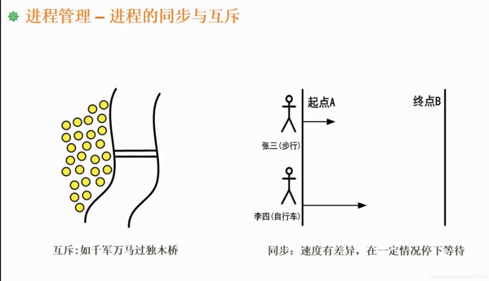
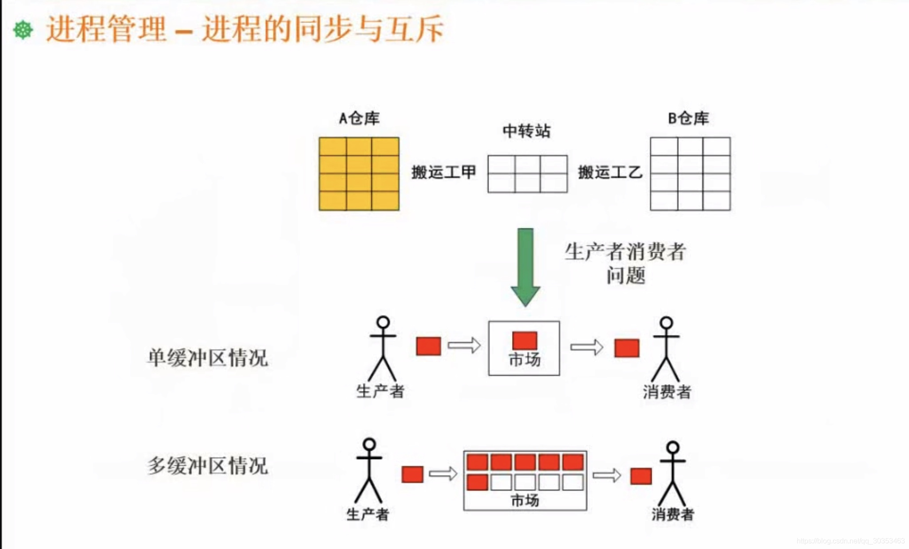

```json
{
  "date": "2021.06.14 12:56",
  "tags": ["rk","软考","软件设计师"],
  "description": "这篇文章介绍了进程的同步与互斥"
}
```

**互斥**
 在同一时刻，只允许某一个进程访问资源。
 同一个资源不能同时服务于多个进程。
 犹如千军万马过独木桥。独木桥就是一个资源，不允许很多人同时上独木桥。因此人员都是一个一个的通过，一个人占用了独木桥资源，其他人得等待。
 如果不是独木桥，而是一个人行天桥，大家都可以同时使用资源，这时候我们认为这是共享资源。

** 同步和互斥是否互为反义词？**
不是，互斥的反义词是共享。同步的反义词是异步。

**同步**
张三和李四约好去逛商场，张三步行前往，李四骑自行车。他们从同样的起点到同样的终点。可以预见的是，步行速度比较慢，骑自行车速度比较快，如果他们都是全速前进，毫无疑问，李四先到达终点，但是他们约好了，他们要同时到，那么李四在骑自行车一段时间之后，发现超越张三一段距离了，那么就需要停下来，等一等。这就是同步的过程。
同步有速度匹配的要求，在差距拉的比较大的时候，要求速度快的停下来，等待速度慢的，这就是同步。


## 生产者和消费者问题
**单缓冲区** 
市场容量只有一，存放了一个物品，他就不能再存放了。
对于市场的操作来说，在同一时刻，不能既有生产者往里面存东西，又有消费者往里面取东西。
在同一时刻，只能有一类人进去操作，这就是互斥。

生产者往市场里存了一个东西，而市场容量只有一，市场此时就满了。一旦生产者再往里面存东西，就会产生溢出的情况。只有等到消费者往市场取走这个东西，才允许生产者再往里面存东西。这个过程和李四在等张三，是不是一回事？生产者要停下脚步，等消费者消费这个产品，才能继续往里面存东西，这就是同步。

**多缓冲区**
相比起单缓冲区，只是在同步的时候可以放更多的东西。比如不再限制放一个可以放十个。放满之后才会停下来，等消费者。

对于pv操作，你需要分析哪里是互斥，哪里是同步。

