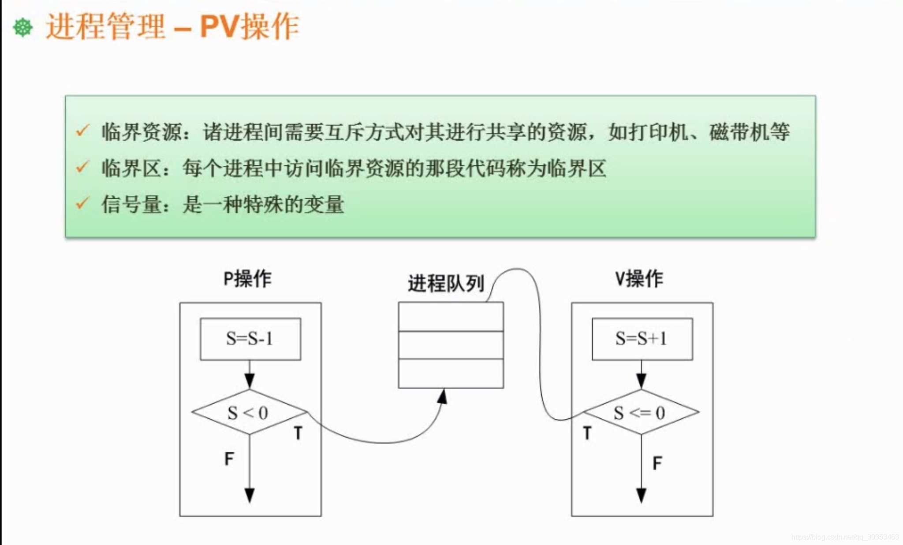
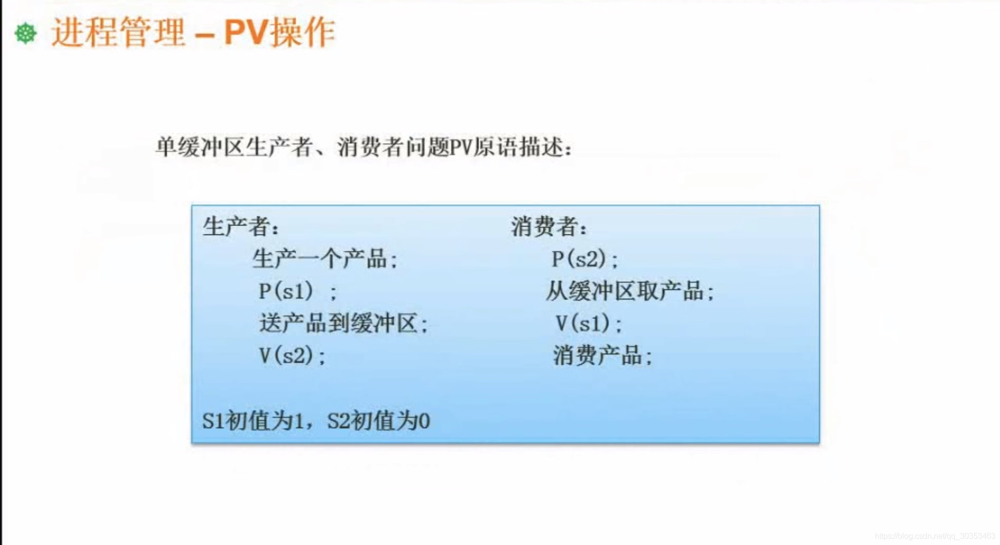

```json
{
  "date": "2021.06.14 13:53",
  "tags": ["软件设计师"],
  "description": "这篇文章介绍了pv操作"
}
```



 **临界资源**
 进程间需要互斥的方式进行共享的资源。
 就比如上一章说到的千军万马过独木桥，其中的独木桥就是临界资源。

**临界区**
访问临界资源的代码。
通俗点讲，临界区就是代码段。

**信号量**
pv操作中离不开信号量。
通常会有这样的写法  p(s) v(s)  其中的s就是信号量。
信号量是应用在pv操作中，一种专属的变量。

## pv操作
Pv操作就是由p操作和v操作，组成的一套操作。

**p(s)**
首先会将信号量s做自减一的操作，比如原本信号量s=10，那么自减一就等于九了。
如果s此时小于零，进程就会阻塞。并且这个进程会进入一个进程队列里，这个进程就进入了等待状态。
如果s此时大于等于零，程序就会继续执行。
 
 **v(s)**
 首先会将信号量s做自加一的操作。
 再判断s此时是否小于等于零，如果满足，则从进程队列里取出一个进程，唤醒，并让他继续执行。
 否则程序继续执行。



**假设没有pv操作**
我们先看上面这张图，把上面这张图所有的pv操作先在脑海里去掉。
系统里有两个进程，一个是生产者，一个是消费者。
生产者负责生产一个产品，并且将产品送到缓冲区去。
消费者负责从缓冲区取产品，并且消费产品。

最初缓冲区是空的，允许生产者往里面填东西，假设此时我执行了一个生产者进程，生产了一个产品，并且将它送到了缓冲区，此时这个过程是没有问题的，可以顺利把商品放到缓冲区。
这时候生产者进程再次执行，又要将产品往缓冲区里送，此时缓冲区已经满了，此时再放产品就会溢出。这时候系统就出问题了，因此这也是Pv操作所要解决的问题。
又比如先执行消费者，此时缓冲区是空的，那么从缓冲区取产品也会报错。


**Pv操作**
我们回到这张图，在pv操作都完善的情况下，看系统是否会异常。
同理，生产者也要生产一个产品，此时多了一步P(s1)操作，由于s1的初值是1，那么在做P操作之后，S1的值为0。由于没有小于零，则继续往下操作，就会将产品送到缓冲区去，完了之后，再执行v(s2)操作，使得s2的值为1。
此时我们不执行消费者进程，再一次执行生产者进程模拟刚刚的异常情况，同理，生产者生产了一个产品之后，就要开始P(s1)操作，那么，此时s1的值就变成-1了。由于-1小于0，那么当前进程就会被放入到进程队列里，程序就会阻塞起来。产品也不会有溢出的情况。
此时我们再看回消费者，由于s2在生产者阶段就已经变成了1，那么消费者的P(s2)操作使s2的值变为0，并且因为0没有小于0，程序继续往下执行，接下来就来到了V(s1)操作，此时s1是等于-1的，那么v操作之后就变成了0。那么就会从进程队列里取出队列，当生产者被激活后又会执行 送产品到缓冲区 这个动作。


假设一开始执行的是消费者，那么P(s2)操作，S2的初值为0，那么p操作后，s2的值为-1。S2小于零则会被阻塞，程序就会阻塞起来，而不会去执行报错了。


由此看来，pv操作就是为了解决并发操作时，一些资源如何处理的问题。