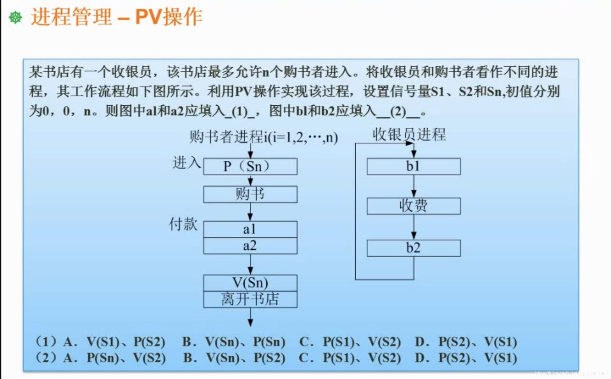

```json
{
  "date": "2021.06.14 16:29",
  "tags": ["rk","软考","软件设计师"],
  "description": "这篇文章练习下PV操作"
}
```



 主要考点是pv操作中进程之间的约束关系。
 哪些地方需要阻塞进程，等待另外的进程。

该书店最多允许n个购书者进入，意味着当购书者数量达到了n，购书者进程就应该阻塞。在题目图中，其实已经实现了这个功能。因为购书者进程进入时，先执行了p(sn)，当购书者进程要离开书店之前，执行了V(sn)。

然后看到购书者进程，在购书结束后，付款处有a1和a2两个动作。此处的a1和a2是需要和收银员进程进行交互的。

然后再看回收银员进程，收银员在收费之前进行了一个b1动作。结合刚刚的购书者进程，此处的b1动作，应该是购书者提出缴费需求。那么此处的b1动作，肯定是一个p操作， 可以理解为没有购书者进程唤醒他，收银员可以一直睡大觉。对应的a1则是v操作，他负责唤醒收银员，让他起来收款。由于题目一般是按顺序去配对信号量的，那么此处的b1就是p(s1)，a1就是v(s1)。

那么此处的a2是什么意思呢？购书者在付款之后是需要等待收银员收款确认，才算完成交易。因此此处的a2就是一个p操作，相应的b2则是收银员在收费后，确认数目无误后，通知购书者可以离开了，因此b2是一个v操作，因此a2是p(s2)，b2是v(s2)。

因此选A,C
