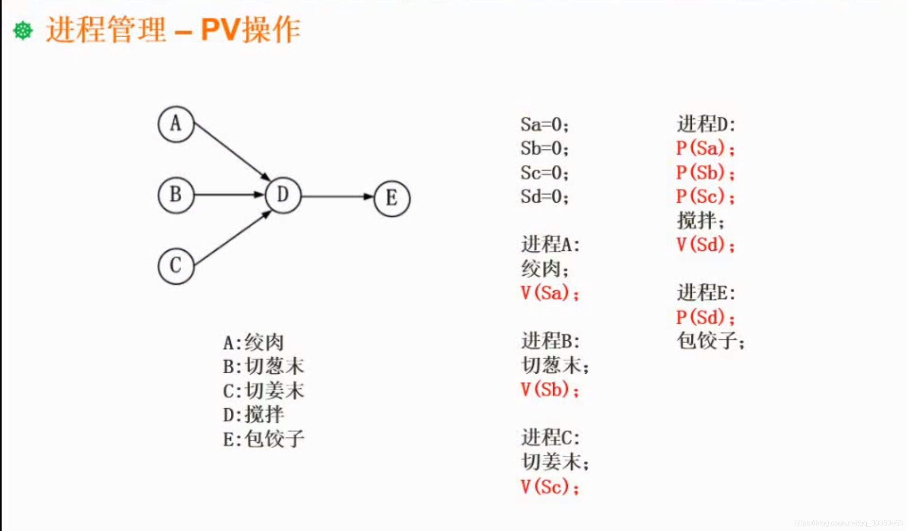
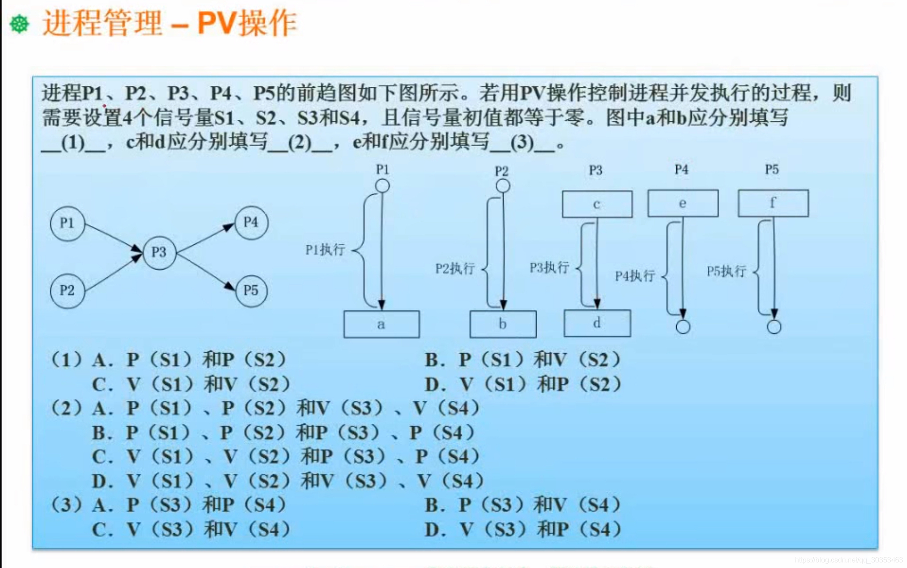
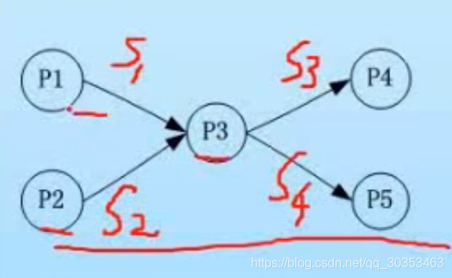

```json
{
  "date": "2021.06.14 17:02",
  "tags": ["rk","软考","软件设计师"],
  "description": "这篇文章介绍下PV操作与前驱图的关系"
}
```




前驱图确定了进程间的依赖关系，我们可以通过前驱图转换成Pv操作。

此处abcde都是独立的进程，都是需要完成的任务。ABC没有箭头指向他，说明它是不需要等待别的进程进行操作的。而d有ABC三个箭头指向他，说明d操作需要ABC三个进程完成之后，才能够开始。同理，E操作需要等待D操作完成后才能够开始。

那么我们的思路就从接收开始，既然d操作需要ABC三个进程完成之后，才能够开始。那么显然进程d包括了p(sa) p(sb) p(sc)三个p操作。由于pv操作是成对出现的，那么同理进程a就是v(sa)操作，进程b是v(sb)操作，进程c是V(sc)操作。

同理，E操作需要D操作完成之后才能够开始，那么进程E就包括了P(sd)操作，相对应的进程d也还有V(sd)操作。



 
 这道题左边是进程的前趋图，右边是进程的pv操作。

做这种题的时候，先把信号量标到图上。遵循从左到右，从上到下的顺序。



箭头的起点就是v操作，箭头的结尾就是p操作。

p1进程(a)是v(s1)
p2进程(b)是v(s2)
p3进程是(c)p(s1)，p(s2)  (d)v(s3)，v(s4)
p4进程是(e)p(s3)
p5进程是(f)p(s4)

