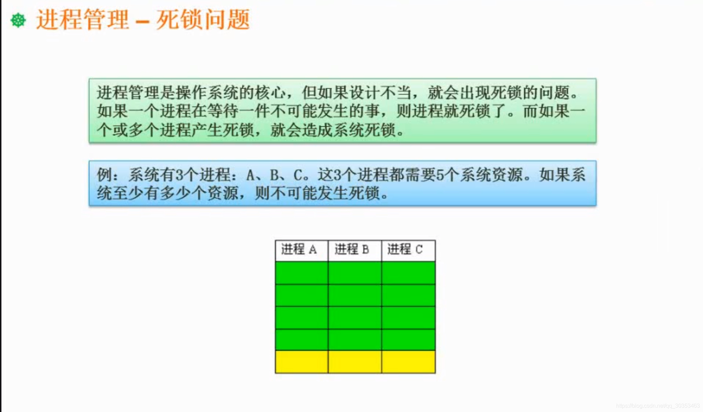

```json
{
  "date": "2021.06.14 17:14",
  "tags": ["软件设计师"],
  "description": "这篇文章介绍下死锁问题"
}
```



进程需要统分配资源才能运行，当某一时刻，所有资源都已经分配出去了，而所有的进程都无法完成他的任务并释放他占有的资源，这时候就产生死锁。
所有的进程都在等待别人给他分配资源，而自己又不愿意释放资源。


如上题，我们先给每个进程都分配四个资源，那么一共就有12个。此时只需要再多一个资源，就能确保其中一个进程，完成他的任务，当他完成了任务之后，就会释放自己占有的所有资源。

所以这种解题思路，就是先给每个进程分配它最大资源-1个资源，在这基础上，再加一个资源。