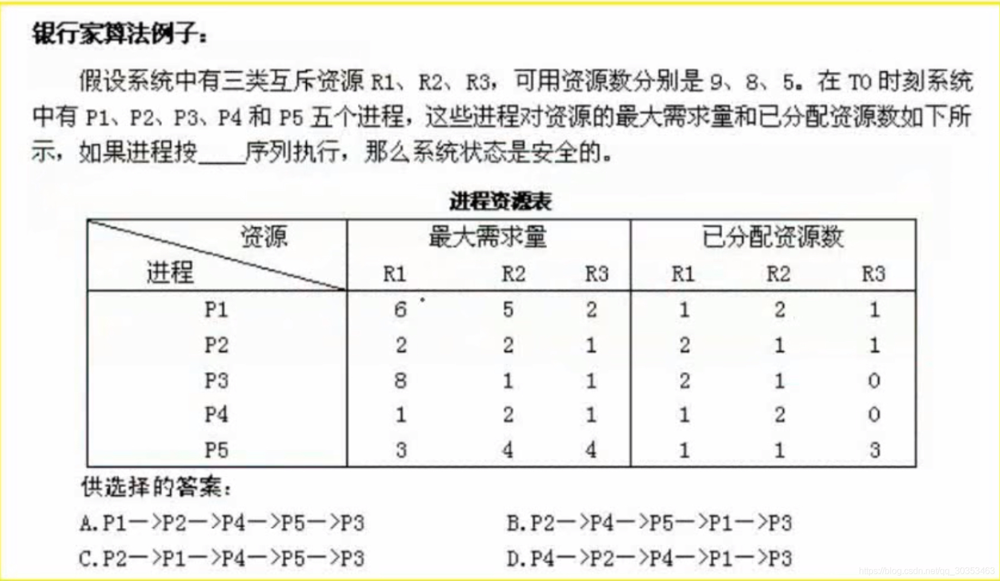

```json
{
  "date": "2021.06.14 18:07",
  "tags": ["rk","软考","软件设计师"],
  "description": "这篇文章介绍下银行家算法"
}
```


 死锁有四大条件，缺少一个都无法形成。
 条件一是互斥，资源只允许其中一个进程使用。
 条件二是保持和等待，当进程缺少资源，会保持和等待系统给他分配更多的资源。
 条件三是不剥夺，是指系统不会剥夺这个进程的资源。
 条件四是环路等待，比如ABC三个进程，a在等待b释放资源，b等待c释放资源，c等待a释放资源。


**死锁的预防**
打破四大条件
1. 进程间允许共享资源。
2. 系统未分配资源，则释放自身资源。
3. 允许系统剥夺自身的资源
4. 等待其他进程的时候，设置个最大时间，或者最大次数。

**死锁的避免**
 有序资源分配法，这种方案的资源利用率比较低

银行家算法，是以银行放贷的思路。


在银行家算法中，系统资源就相当于银行的钱。
银行在放贷的过程中，他会考虑你这个钱是否可以收回。如果预估这个钱是无法回收的，则不会通过这笔贷款。


题目问进程按什么样的序列执行，系统状态是安全的？其实也就是如何分配不产生死锁

计算此类题目首先得算，当前系统还剩多少个资源？
从上到下可以看出r1资源，给p1分配了一个，给p2分配的了两个，给p3分配了两个，给p4分配了一个，给p5分配了一个，而p1可用资源数是9，那么p1资源剩余2个，统计p2资源剩余1个，p3资源剩余0个。

然后我们算出每个进程还需要多少个资源？

最后我们把可用资源尝试分配给每个进程，如果可用资源数大于这个进程所需要的资源，那么这个进程就是可以执行的。
当这个进程执行完之后，它所占用的所有资源将会释放。同理，我们加上这个进程所占有的资源分配给下一个进程。

因此做这种题目最优的办法是排除法，把每个选项所标明的序列，一一代入，这种题目往往只有一个正确答案，也就是说，只有一条序列是可以运行的。

可以看出，p1还需要5个r1资源，而此时系统可用的r1资源仅剩两个，那么我们就可以排除以p1为首的选项了，也就是A
同理，此时系统可用的r3资源剩下零0个，那么p3，p4，p5为首的选项也可以排除，也就是D
执行完p2后，p2占用的资源会释放，系统可用资源分别是r1，r2，r3是4，2，1。
由于p1的r1资源需要5个，实际只有4个，排除选项B
那么就剩下A。

下图展示了正确序列的资源使用情况。


