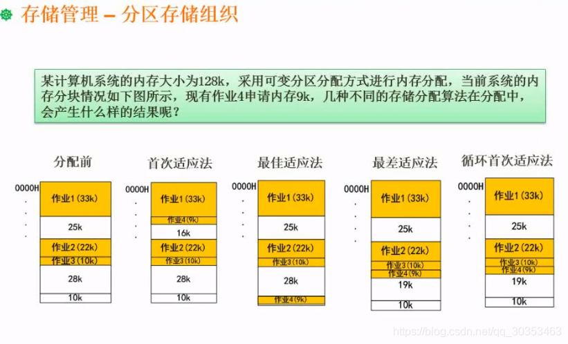

```json
{
  "date": "2021.06.18 20:00",
  "tags": ["rk","软考","软件设计师"],
  "description": "这篇文章介绍下分区存储组织"
}
```


### 分配前
**作业1和作业2中间的25k哪来的？**
一开始作业1分配了33k，某个作业分配了接下来的25k，接下来是作业2的。当这个作业完成了，就会释放空间。因此就会空出一块。

### 首次适应法
首次能够容纳9k的方法分配出去。

### 最佳适应法
空闲区块按大小顺序连接。当前空闲的三个块分别是25,28,10。当他发现10k已经放得下，就分配出去了。

如果在分完这9k之后，还需要分配10k。由于此时剩余空间剩25,28,1。首先去到1这个空间，发现不够。就去到25这个空间，发现可以就分配出去了。

缺点：内存碎块非常多，碎块非常小。

### 最差适应法
与上述同理，只是从大到小分。

优点：内存碎片减少

### 循环首次适应法
由于作业3是在28k这个碎片这里分配的，因此从28k这个碎片开始首次适应。

