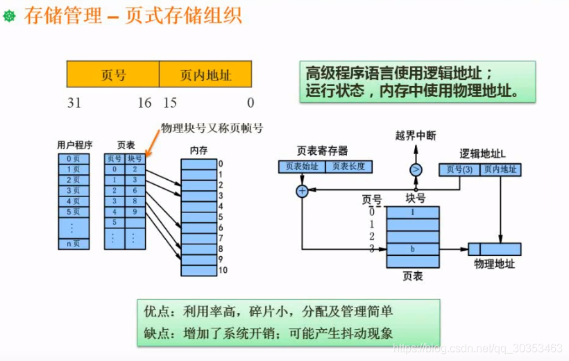

```json
{
  "date": "2021.06.18 20:31",
  "tags": ["软件设计师"],
  "description": "这篇文章介绍下页式存储、段式存储以及段页式存储"
}
```


## 页式存储
如果说内存是4G，用户已使用2G，如果要运行2G以上的程序是不行的，哪怕是1G都够呛。因为在内存空间很容易就会被打碎，虽然空闲区有2G大，但未必有连续的1G内存。为了解决这个问题，就有了页式存储。

把用户程序分成等分大小的页。比如上方例子，把用户程序分成了等分的页，把存储区也分成等分的页。在运行这个用户程序时，不再是整块放进内存运行，而是要运行哪些块再调入。这样就需要一个页表来映射用户程序和内存块。

用这个思路，甚至能运行4G的程序。

优点： 内存利用率高。
缺点：增加系统开销；可能产生抖动现象。因为页表本身，及查表操作都需要花费系统资源。


**第一个空**
先把逻辑地址分成 逻辑页号 和 逻辑页内地址

此时的逻辑地址是5A29H。

页面大小是4k，4k=2^12^b，这意味着一个页是12位。高于12位的就是页号。

其中16进制每一位代表了2进制的4个位。这个很早的课程有说。

那么12位就代表末尾的A29，那么页号就是5，逻辑页内地址是A29。（所以备选答案都带A29）

问题关键就成了已知页号是5，对应的物理块号是多少？ 查表得知页帧号（物理块号）是6，拼上A29之后选D。

**第二个空**
如果访问4不在内存，要淘汰哪个页面？
很显然，在内存才能淘汰。状态位是1才是在内存的。备选是0，1，2，5。

第二个考虑的点是，刚被访问过的不能淘汰，也就是访问位=1的。那么排除0，2，5。选B

**段式存储和页式存储区别**
段的大小不一定一致。页式的页大小必须一致。

优点： 便于共享
缺点：内存利用率较低，内存碎片浪费大


结合段式和页式综合形成。


快表放在cache。