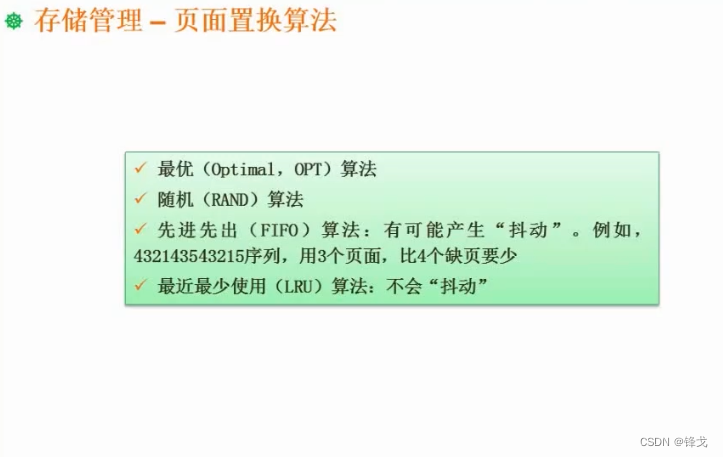
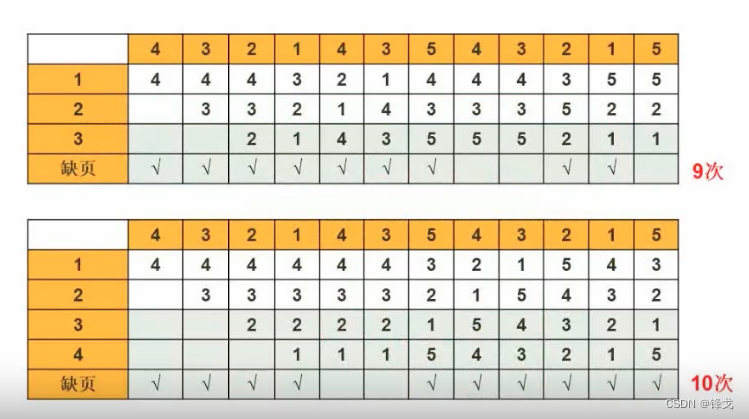
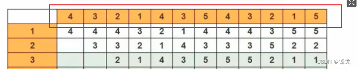
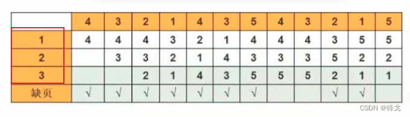
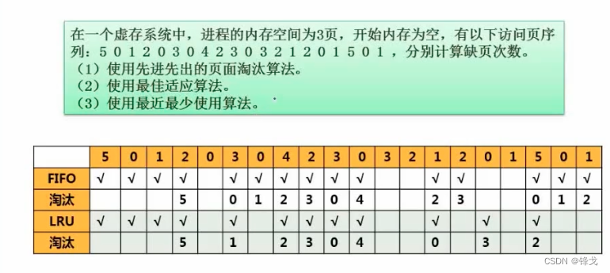

```json
{
  "date": "2022.05.06 23:15",
  "tags": ["软件设计师"],
  "description": "这篇文章介绍下页面淘汰算法"
}
```





### 页面置换是什么

页面置换算法广泛引用于分层的存储体系中。

之前讲cache已经提到过，cache数量有限，所以当cache的块都被占用了，要调用新的块进来的时候，就涉及页面的置换问题。在内存这一个体系，同样也面临这样的问题。

比方说页式存储中，一个程序有100个页，但是内存可以分配给它的页是非常有限的，比如说只有三个页。这时候就不可避免在程序运行过程中，我们要把一些不用的页调出来，把要用到的页调进去。这要依据一定的算法来进行识别哪些页淘汰是比较好的，这就涉及到页面的置换（淘汰）算法。

### 页面置换算法有哪些

页面置换算法具有典型代表性的有这么几种。

#### 最优算法
> 理论层面上的算法。
> 它是在整个事情发生之后，也就是我们已经知道访问的页面序列是怎样的，根据页面序列分析算出什么时间点淘汰什么页面能够取得最高的效率性能。
> 根据不同的实际场景，最优算法肯定能得出不同的解决方案，没有普遍的规律。
> 在实际访问中往往没办法了解整体的页面序列，比如涉及到分支，那就会根据条件进行判断，我们就不知道下一个页面应该访问哪一个，整个完整序列是排不出来的。
> 所以最优算法在实际是无法直接应用的。
> 它的应用场景是**把最优的写出来，再和其他的算法方案进行对比。看其他方案和最优相比差距有多大**


#### 随机算法
> 随机淘汰一个，性能不稳定。考试一般不会考。


#### 先进先出算法
> 要淘汰页面的时候，就看哪些页面是最先进入到内存的，那就先淘汰什么。
> 
> 先进先出有可能造成“抖动”
> 
> “抖动”：我分配给你更多的资源，我希望你把这个事情做得更加好一些。结果不但没有出现正面的效果，反而让效率降低了。
> 
> 在置换算法的表现是：
> 我在内存里给你分配3个页面，原本页面的缺页假设是9次。然后我给你分配4个页面，资源多了。这时候你的缺页达到了11个甚至14个（具体可以看下方例子）。造成结果更坏了。这就会导致该不该增加资源分析起来更加复杂。


#### 最近最少使用
> 根据局部性原理，刚刚被访问过的页面很可能马上就会被访问到。所以不会被淘汰。
> 
> 不会“抖动”，也就是分配的资源越多，表现的越好。


### 先进先出的“抖动”现象



其中列是**要访问的程序页**<br />



其中行是**内存的页**<br />



#### 步骤解读
先看上面3页内存的情况

1. 首先访问第一个编号为4的程序页，这时候内存没有这个程序页，那么就会调入到内存，并且产生一次**缺页（内存里没有）**。
1. 编号为3的同理，产生一次缺页。
1. 编号为2的同理，产生一次缺页。
1. 访问到编号为1的时候，这时候内存里存储着4，3，2这3个页。由于4号页最新进入内存，于是被淘汰了。编号为1的就可以被调入到内存。由于此次内存是没有1号的页，所以还是缺页。
1. 访问到编号为4的时候，同理淘汰3号页，调入4号页，并且还是缺页。
1. 以此类推，缺页次数达到9次。

同样的读取状态，看下4页内存的情况，缺页次数会达到10次，也就是造成了“抖动”的现象。


### 练习题



#### 分析

1. 前面5，0，1对于两种算法是一样的。因为大家都会产生缺页（内存里没有），而且不涉及淘汰的问题。
1. 到达2号页时，由于内存已经存了【5，0，1】且没有存储2，所以就要淘汰了。那么先进先出（FIFO）就会淘汰**最先进入**的5，最近最少（LRU）就会淘汰**最远使用**的5。
1. 到达0号页时，内存此时存的是【0，1，2】。处于命中状态。
1. 到达3号页时，内存此时存的是【0，1，2】。由于没有3号，因此要淘汰一个页。那么先进先出（FIFO）就会淘汰**最先进入**的0，最近最少（LRU）就会淘汰**最远使用**的1。
> 为什么最远使用的是1呢？
> 
> 因为内存此时存的是【0，1，2】，其中0是刚刚访问过的，属于最近的，不能被淘汰。那么接下来就按顺序就剩【1，2】，那么最远的就是1。

5. 后面的均同理。此处我整理访问的状况
   
| 访问的页 | FIFO：淘汰前的存储 | FIFO的淘汰 | FIFO缺页累计 | LRU：淘汰前的存储 | LRU的淘汰 | LRU缺页累计 |
| --- | --- | --- | --- | --- | --- | --- |
| 5 | 【】 | 无需淘汰 | 1 | 【】 | 无需淘汰 | 1 |
| 0 | 【5】 | 无需淘汰 | 2 | 【5】 | 无需淘汰 | 2 |
| 1 | 【5,0】 | 无需淘汰 | 3 | 【5,0】 | 无需淘汰 | 3 |
| 2 | 【5,0,1】 | 5 | 4 | 【5,0,1】 | 5 | 4 |
| 0 | 【0,1,2】 | 命中了 | 4 | 【0,1,2】 | 命中了 | 4 |
| 3 | 【0,1,2】 | 0 | 5 | 【0,1,2】 | 1 | 5 |
| 0 | 【1,2,3】 | 1 | 6 | 【0,2,3】 | 命中了 | 5 |
| 4 | 【2,3,0】 | 2 | 7 | 【0,2,3】 | 2 | 6 |
| 2 | 【3,0,4】 | 3 | 8 | 【0,3,4】 | 3 | 7 |
| 3 | 【0,4,2】 | 0 | 9 | 【0,4,2】 | 4 | 8 |
| 0 | 【4,2,3】 | 4 | 10 | 【0,4,2】 | 命中了 | 8 |
| 3 | 【2,3,0】 | 命中了 | 10 | 【0,4,2】 | 4 | 9 |
| 2 | 【2,3,0】 | 命中了 | 10 | 【0,2,3】 | 命中了 | 9 |
| 1 | 【2,3,0】 | 2 | 11 | 【0,2,3】 | 0 | 10 |
| 2 | 【3,0,1】 | 3 | 12 | 【2,3,1】 | 命中了 | 10 |
| 0 | 【0,1,2】 | 命中了 | 12 | 【2,3,1】 | 3 | 11 |
| 1 | 【0,1,2】 | 命中了 | 12 | 【2,1,0】 | 命中了 | 11 |
| 5 | 【0,1,2】 | 0 | 13 | 【2,1,0】 | 2 | 12 |
| 0 | 【1,2,5】 | 1 | 14 | 【1,0,5】 | 命中了 | 12 |
| 1 | 【2,5,0】 | 2 | 15 | 【1,0,5】 | 命中了 | 12 |

