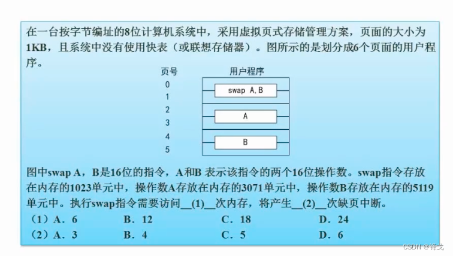

```json
{
  "date": "2022.05.07 15:56",
  "tags": ["软件设计师"],
  "description": "这篇文章介绍下页面淘汰算法练习题"
}
```





<a name="C0VEN"></a>
### 解题思路

<a name="hN1E4"></a>
#### 没有使用快表 
每读一次内存都需要先在内存上查表，读取相应的内存块，所以每个块需要2次内存访问。<br />图中有6个块，所以有6 * 2 = 12次内存访问

<a name="uHrwL"></a>
#### 缺页中断
约定俗成：无论指令占到几个块，都会一次性调入。

swap指令跨了2个页，（swap指令存放在内存的1023单元）每个单元就是一个字节，第一个块是从0字节到1023字节，1023是块的最后一个单元，存只能存指令的一半，还有一半存在1号页的开始处。

既然跨了2个页，按照常规应该产生2次缺页中断。但实际上，对于指令而言，只会产生一次缺页中断。

而操作数A在2号页，3号页各有一半，会产生2次缺页。B同理，所以总的缺页中断为5次
