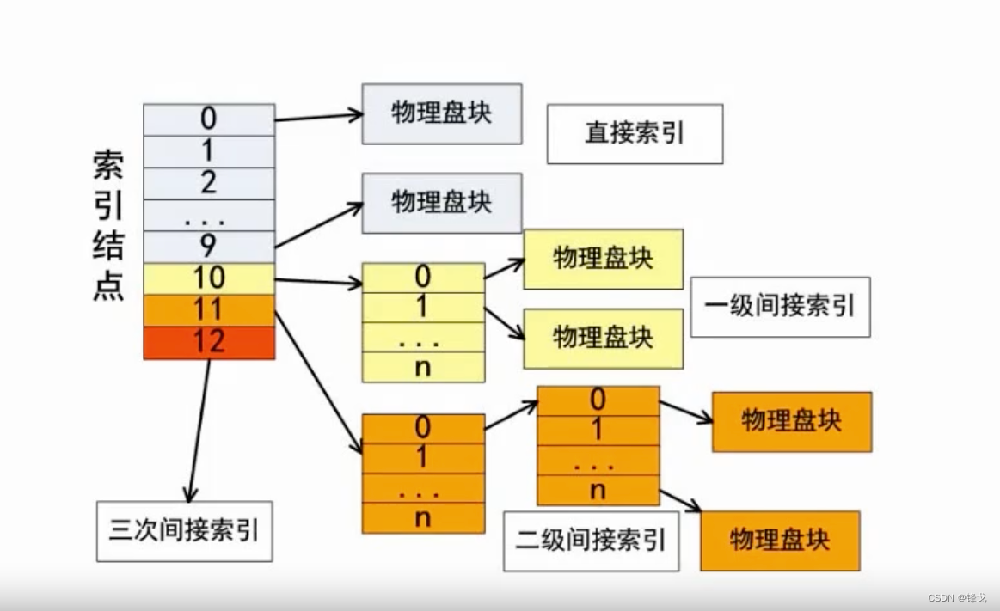
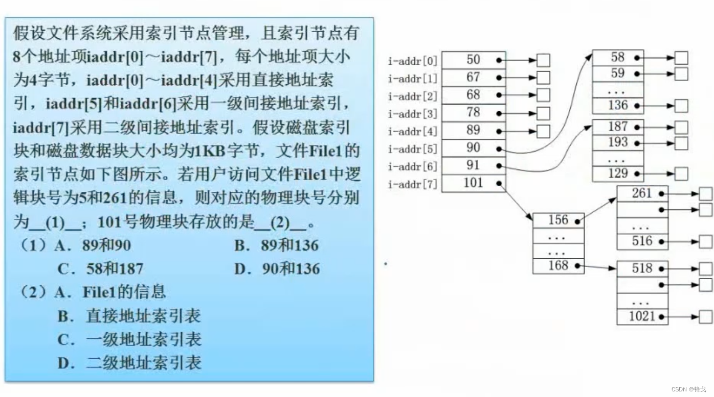
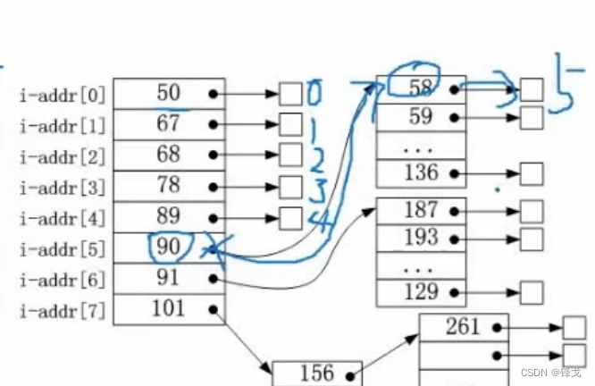

```json
{
  "date": "2022.05.11 23:14",
  "tags": ["rk","软考","软件设计师"],
  "description": "这篇文章介绍下索引文件结构"
}
```




索引文件结构本身的容量很有限，它引入了一种扩展机制，可以很方便的把文件的容量扩大很多倍。

一般的索引文件结构是有13个节点，编号从0到12号（如果考试不是13个节点，也会说明分布情况），这个例子分成四部分：**直接索引、一级间接索引、二级间接索引、三级间接索引**。

比方说，一个物理盘块是4k大小。假设13个块都是直接索引，那么这个文件最大容量是4k*13=52k。可以容纳的空间太小。

#### 索引文件结构分布
索引结点存的是13个地址。
1. 结点0-9是直接索引，它们的地址直接对应物理盘块，物理盘块存索引文件的内容。（10*4k=40k）
1. 结点10存的是物理盘块的地址，每个地址假设占4个字节，那么就能存1024个物理盘块的地址（4k/4b=1024）。每个物理盘块的地址对应物理盘块，在物理盘块再存索引文件的内容（1024*4k）
1. 结点11存的是物理盘块地址的地址，地址的地址映射到地址，地址对应物理盘块（1024*1024*4k）
1. 结点12同理（1024*1024*1024*4k）

**存储空间大了，寻找的速度也会变慢。**

<a name="ozyOp"></a>
### 练习题


<a name="X3E8Y"></a>
#### 答案
1、C <br />2、D
<a name="WA0kF"></a>
#### 题意分析

1. 此题不是0-13这样的结点，但是会明确有8个结点。并告知0-4是直接索引，5-6是一级间接索引，7是二级间接索引。
1. 逻辑块号为5要怎么数呢？如图所示，是物理块号为58的位置。




3. 由于一个物理盘块1KB，一个地址项为4字节，那么一个物理盘块能存256个地址（1024/4）。

逻辑块号为5的是i-addr[5]指向的第一个地址，逻辑块号为261距离逻辑块号为5与256个地址（261-5），也就是说逻辑块号为261的地址是下一个块的第一个地址，也就是物理块号为187的位置。

4. 101号物理块对应的是i-addr[7]，也就是存的二级间接索引。

