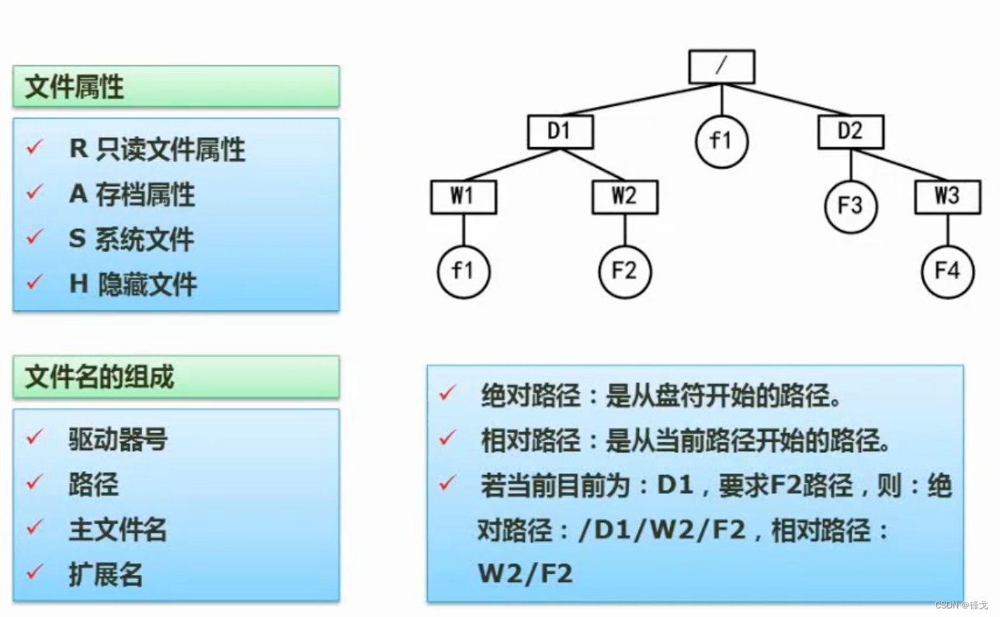

```json
{
  "date": "2022.05.11 23:31",
  "tags": ["软件设计师"],
  "description": "这篇文章介绍下树形目录结构"
}
```





在树形目录结构中，有绝对路径和相对路径之分。

举例：当前处于D1，描述f1的位置。<br />绝对路径：从盘符开始的路径，也就是从/开始，那么位置就应该是 **/D1/W1/f1**<br />相对路径：从当前路径开始算，也就是D1开始，那么位置就是  **W1/f1**

#### 生活中的应用
比如当前位于长沙，想拨打一个长沙一个机构（88888888）的电话，那么我直接拨打88888888即可。
但是当我出差到北京，我直接拨打88888888会联系不上长沙的机构，因为北京也有这样一个电话号码，这时候我们就应该加上长沙的区号再拨打。
那么当我去到美国纽约，我拨打长沙区号+88888888还是联系不上长沙的机构，因为无法描述中国这个地区，需要加上中国的特定代码才能拨打。
所以当我们拨打国家代码+长沙区号+88888888可以在任意地方联系到长沙机构，当然他的缺点是号码很长。


<a name="QKFni"></a>
#### 相对路径和绝对路径的特点

1. 相对路径短，绝对路径长
1. 无论当前处于哪个目录，绝对路径都可以精确提供一个位置，相对路径则会不断变动。
